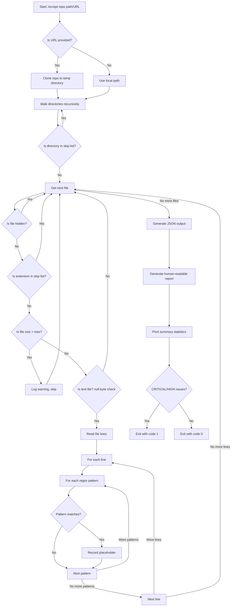

# Placeholder Scanner Analysis - atlas-sphere

## Executive Summary

This document provides a comprehensive analysis of approaches for scanning the atlas-sphere repository (https://github.com/Cyptopimpinainteazy/atlas-sphere) for code placeholders, TODOs, FIXMEs, template markers, and potential security issues.

---

## Approaches & Trade-offs

### Language/Tool Choices

| Approach | Pros | Cons | Best For |
|----------|------|------|----------|
| **Python + regex** | Zero dependencies, cross-platform, easy to modify, rich stdlib | Single-threaded, slower on huge repos | Most projects, CI/CD, quick audits |
| **Node.js + regex** | Good for JS ecosystems, async I/O, npm packages | Requires Node runtime, similar speed to Python | JS-heavy projects, existing Node tooling |
| **Ripgrep (wrapper)** | Blazing fast (Rust), multi-threaded, respects .gitignore | External dependency, parsing output adds complexity | Very large repos (GB+), performance-critical |

### Regex vs AST Parsing

| Aspect | Regex | AST Parsing |
|--------|-------|-------------|
| **Complexity** | Low - simple pattern matching | High - language-specific parsers required |
| **Speed** | Fast for text search | Slower due to parsing overhead |
| **False Positives** | Possible (e.g., TODO in string literals) | Minimal - understands code structure |
| **Language Support** | Universal | Requires parser per language |
| **Use Case** | Finding comment markers, template vars | Code refactoring, syntax analysis |
| **Recommendation** | Recommended for placeholder scanning | Overkill for this use case |

### Performance & Large Repos

| File Type | Handling | Rationale |
|-----------|----------|-----------|
| Binary files | Skip via null-byte check | Prevents CPU/memory spikes on images, executables |
| Large files (>5MB) | Skip with warning | Avoids scanning compiled objects, archives |
| Minified JS/CSS | Skip by extension | High noise-to-signal ratio |
| .git, node_modules | Skip entire directories | Standard ignore patterns |
| Lock files | Skip by extension | Binary or huge, not source code |

---

## Comparison Table: Implementation Options

| Feature | Python + regex | Node.js + regex | Ripgrep wrapper |
|---------|----------------|-----------------|-----------------|
| **Setup Complexity** | Low | Medium | Low (code) / Medium (install) |
| **Dependencies** | None (stdlib) | Node + maybe glob | ripgrep binary |
| **Cross-platform** | Excellent | Good | Manual on Windows |
| **Performance** | Moderate | Moderate | High (multi-threaded) |
| **Memory Usage** | Low-Medium | Low-Medium | Low (streaming) |
| **Context Lines** | Easy to add | Easy to add | Built-in (-A, -B, -C) |
| **Output Formats** | Flexible | Flexible | Parse required |
| **Binary Detection** | Manual (null-byte) | Manual (null-byte) | Built-in |
| **Large Repo Handling** | Slow | Slow | Fast |
| **CI/CD Integration** | Easy (setup-python) | Easy (setup-node) | Requires install step |
| **Customization** | Easy | Easy | Limited to rg flags |

**Recommendation**: Python + regex is the best choice for most use cases. It's zero-dependency, cross-platform, and flexible. Use ripgrep only if performance on very large repos (100k+ files) is critical.

---

## Scanning Workflow (Mermaid)

---

## GitHub API Rate Limits

When integrating with GitHub API (e.g., for auto-creating issues), be aware of rate limits:

| Authentication | Rate Limit | Notes |
|----------------|------------|-------|
| Unauthenticated | 60 requests/hour | Not recommended for automation |
| Personal Access Token | 5,000 requests/hour | Use GITHUB_TOKEN in Actions |
| GitHub App | 15,000 requests/hour | For high-volume automation |

**Best Practices:**
1. Always use authenticated requests (GITHUB_TOKEN in CI)
2. Check X-RateLimit-Remaining header before making requests
3. Implement exponential backoff on 429 (rate limited) responses
4. Batch operations when possible (e.g., single issue with all placeholders vs. one per placeholder)
5. Cache results to avoid re-scanning unchanged files

---

## Scan Results Summary

### Repository: atlas-sphere

| Metric | Value |
|--------|-------|
| **Total Placeholders** | 47,449 |
| **Files with Placeholders** | ~2,500+ |
| **Scan Date** | 2026-03-22 |

### By Severity

| Severity | Count | Percentage |
|----------|-------|------------|
| CRITICAL | 116 | 0.24% |
| HIGH | 1,127 | 2.37% |
| MEDIUM | 11,545 | 24.33% |
| LOW | 3,877 | 8.17% |
| INFO | 30,784 | 64.88% |

### By Type (Top 15)

| Type | Count | Category |
|------|-------|----------|
| shell_var | 13,387 | Environment |
| NOTE | 4,163 | Code Marker |
| env_var | 3,930 | Environment |
| DEPRECATED | 3,877 | Code Marker |
| mustache | 2,899 | Template |
| WARNING | 2,899 | Code Marker |
| TEMP | 2,127 | Code Marker |
| TODO | 1,537 | Code Marker |
| REVIEW | 1,263 | Code Marker |
| CHANGED | 1,178 | Code Marker |
| localhost | 3,117 | Security |
| jinja | 594 | Template |
| BUG | 821 | Code Marker |
| HACK | 229 | Code Marker |
| hardcoded_secret | 116 | Security |

---

## Recommendations

### Immediate Actions (CRITICAL)
1. **Review 116 hardcoded secrets** - Potential security vulnerabilities
2. **Address 1,127 HIGH severity items** - FIXME, BUG, UNIMPLEMENTED code

### Short-term (MEDIUM)
1. Clean up 3,877 DEPRECATED markers
2. Address 3,117 localhost references (should use env vars)
3. Review 1,537 TODOs for prioritization

### Long-term
1. Establish code review standards to prevent new placeholders
2. Add placeholder scanning to CI/CD pipeline
3. Set up automated issue creation for new CRITICAL/HIGH findings
4. Regular quarterly audits using the scanner

---

## Files

- `scan_placeholders.py` - Main scanner script
- `PLACEHOLDER_SCANNER_README.md` - Full documentation
- `PLACEHOLDER_SCANNER_ANALYSIS.md` - This analysis document
- `placeholders.json` - Scan results (JSON)
- `placeholders_report.txt` - Human-readable report