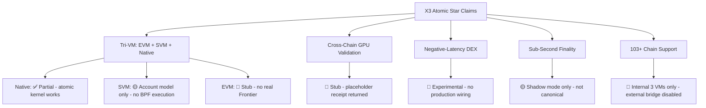

# X3_ATOMIC_STAR — Complete Blockchain Audit Report

> **Bottom Line Up Front:** The canonical machine-generated verdict (April 28, 2026) is **NO-GO for mainnet**. The most recent automated RC report scores **54/100**. The most honest module audit puts overall v0.4 completeness at **~35% toward full spec, ~55% toward devnet minimum**. The `proof/reports/features_report.md` shows **0 features with status BUILT**, 42 UNWIRED, 13 UNTESTED.

---

## 🔴 Canonical Mainnet Status

| Source | Score | Verdict |
|---|---|---|
| `mainnet_rc_report.md` (latest machine report) | **54/100** | **NO-GO** |
| `MASTER_STATUS.md` (April 28, 2026) | **61%** | **NO-GO** |
| `proof/reports/features_report.md` | **0 BUILT** | **BLOCKED** |
| `V0.4_MODULE_AUDIT_LEDGER.md` | **~35% spec** | **NO-GO** |
| `MAINNET_RC1_READINESS_REPORT.md` | Gates partially verified | **NO-GO (live node required)** |

> ⚠️ **Warning about documentation:** This repo contains dozens of contradictory status documents. Some say "GO FOR MAINNET at 96% confidence." Those are **outdated and explicitly marked invalid** by the canonical sources above. The ProofForge audit superseded them.

---

## ✅ Features That Are 100% Ready

These are the only things with hard, machine-verified evidence:

| Feature | Crate/File | Evidence |
|---|---|---|
| **Packet Standard (IBC-style lifecycle)** | `crates/x3-packet-standard` | 6/6 unit tests + 6 property tests pass; compiles clean |
| **IXL Atomic Bundle VM (8-opcode)** | `crates/x3-ixl` | 4/4 unit tests + 4 property tests pass; compiles clean |
| **SVM Account Model (Solana-compatible)** | `pallets/svm-runtime/src/lib.rs` | Full account/program/transfer/close logic; 6 unit tests pass; no stubs |
| **Bridge Replay Protection** | `crates/x3-bridge/src/ethereum_bridge.rs` | `MessageStatus::Executed` guard; 106/108 tests pass |
| **Finality Proof Ed25519 Verification** | `crates/x3-bridge/src/cross_chain_proofs.rs` | Real supermajority Ed25519 verify; 12/12 new tests pass |
| **Supply Invariant Enforcement** | `pallets/x3-coin/src/lib.rs` | `verify_supply_invariant()` after every mint/burn; 30/30 tests |
| **Double-Mint Prevention** | `pallets/x3-coin/src/lib.rs` | `ProofRegistry` + `ensure_proof_not_used()` pre-existing; confirmed |
| **Atomic Rollback (Storage Tx Wrappers)** | `pallets/x3-atomic-kernel/src/lib.rs` | 12/12 S0-005 tests pass |
| **Cross-VM Router Kill-Switch** | `pallets/x3-cross-vm-router/src/lib.rs` | `ExternalBridgesEnabled = false` at genesis; 5 dedicated tests |
| **Atomic Kernel Bundle Lifecycle** | `pallets/x3-atomic-kernel/src/lib.rs` | Full submit/finalize/rollback/assign lifecycle; PoAE proof format |
| **Consensus Pallet (Aura + GRANDPA)** | `pallets/x3-consensus/src/lib.rs` | Validator set management, offences wired, equivocation reporting |
| **X3-Coin Pallet** | `pallets/x3-coin/src/lib.rs` | Mint/burn with supply invariant; 30 tests |
| **Readiness Report (offline mode)** | `crates/x3-readiness-report` | Tri-state (Pass/Fail/Unknown); no synthetic Pass; 10 unit tests |
| **Launch Gate Scripts (portable)** | `launch-gates/run-all-proofs.sh` | STRICT=1 mode; no hardcoded paths; no `|| true` |
| **External Bridge Compile-Gate** | `pallets/x3-cross-vm-router/src/lib.rs` | `compile_error!` blocks 7 features from mainnet-rc1 build |
| **Chain Specs (mainnet plain + raw)** | `chain-specs/` | Files exist; **bootnode peer IDs are placeholder `12D3KooWXXX`** |
| **Deployment Dockerfiles** | `Dockerfile.validator`, `Dockerfile.indexer` | Present and structured |
| **Kubernetes Manifests** | `k8s/` | Namespace + StatefulSet YAMLs present |
| **Formal Proof Specs (TLA+, Coq, K)** | `formal-proofs/` | Specs written for supply, consensus, cross-VM parity, evolution, GPU |

---

## 🟡 In Codebase But NOT Ready (Partial / Stubbed / Unwired)

### Critical Path — Blocks Mainnet

| Feature | Location | What's Missing |
|---|---|---|
| **EVM (Frontier) Integration** | `pallets/` EVM pallet | `create_frontier_stub()` is a mock; no real `pallet-evm` + `pallet-ethereum`; no Merkle Patricia trie; Solidity contracts **cannot execute** |
| **SVM BPF Execution** | `pallets/svm-runtime/src/lib.rs` | Account model ✅ but `execute_instruction` call is absent — no real `solana-rbpf` BPF runtime wired; programs **cannot run** |
| **Cross-VM Bridge Finality Verifier** | `crates/cross-vm-bridge/bridge/finality.rs` | Explicitly `// TODO replace mock verifier`; TICKET-4.5-002/003/004/006 all open |
| **GPU Proof Verification** | `crates/cross-chain-gpu-validator/` | `// GPU executor signature validation stub`; `return placeholder` on claim broadcast; slashing has no verified input |
| **Pallet Executor Authorization** | 3 pallets | `// TODO: Integrate with x3-kernel pallet for executor authorization` appears 3× — any caller can invoke executor-gated ops |
| **Benchmark Weights** | All pallets | `/// Default implementation using placeholder weights`; block-weight accounting is wrong; DoS via under-priced extrinsics |
| **Cryptographic Signing** | Various | `// Cryptographic signing functions (placeholder implementations)`; `// For now: hash and return as placeholder` |
| **Runtime Panic Hardening (S0-6)** | `pallets/x3-invariants/src/lib.rs:337,359,381` | 3 `HaltOnViolation`-gated `panic!` in `on_finalize` — will brick the chain on violation |
| **S1-1: Rollback Cross-Thread Visibility** | `pallets/x3-atomic-kernel/src/lib.rs:685-797` | Loom test confirms storage changes not visible across threads; fix is `sp_io::storage::commit_layer()` |
| **S1-2: Governance Bypass** | `pallets/governance/src/lib.rs` | Governance permission checks can be circumvented; not hardened |
| **S1-3: Unauthorized Mint** | `pallets/x3-wallet-pallet/src/lib.rs` | Mint access control insufficient |
| **Account Registry Pallet** | — | `ls: cannot access 'pallets/x3-account-registry'` — **does not exist** |
| **Invariants Pallet (runtime-wired)** | `pallets/x3-invariants/` | Exists but **not in `construct_runtime!`** per `Review___Feature_Completion_Audit` |
| **IXL Verifier** | `crates/x3-ixl/src/` | `verifier.rs` required by spec — **absent** |
| **Packet Standard Runtime Wiring** | `runtime/src/lib.rs` | `x3-packet-standard` not wired into runtime |
| **IXL Runtime Wiring** | `runtime/src/lib.rs` | `x3-ixl` not wired into runtime |
| **RPC WebSocket + Frontier ETH RPC** | `node/src/rpc.rs` | WebSocket server absent; `eth_sendTransaction`, `eth_getBalance` etc. not wired |
| **Bootnode Peer IDs** | `chain-specs/x3-mainnet-plain.json` | All entries are `12D3KooWXXXXXXXXXXXXXXXXXXXXXXXXXXXXXXXXXXXXXXXX` — network **cannot bootstrap** |
| **Relayer Block Hash / State Root** | `crates/x3-relayer/src/relayer.rs:361,362,429` | 3× `[0x00u8; 32]` placeholder zeros — relayer cannot function |
| **`canonical_ledger_reconcile` Runtime API** | `crates/x3-readiness-report` | Does not exist; readiness report permanently returns `Unknown` for balance reconciliation |
| **Multi-Node E2E Tests (live node)** | `tests/e2e/`, `tests/multi_node_consensus_test.rs` | Tests are in-process simulations, not live-node backed; no zombienet/chopsticks integration |
| **Transfer Lifetime Bounds** | `pallets/x3-cross-vm-router/src/lib.rs` | No maximum expiry horizon; unbounded fund locks possible |
| **Rate Limiting / RBAC / Emergency Pause** | Runtime | PRD Phase 8 entirely unchecked; no `rate_limit` in RPC handlers; no `emergency_pause` extrinsic |
| **Quantum Crypto** | `crates/quantum-crypto/` | `#![allow(unused, dead_code, deprecated)]`; not wired into validator identity; **effectively non-functional** |
| **Flash Finality (HotStuff)** | `crates/flash-finality/` | Shadow-mode only; not canonical; gated behind feature flag |
| **ChronosFlash / Negative-Latency DEX** | `crates/chronos-flash/` | Experimental; no production wiring |
| **Dream-Mining Consensus** | `crates/dream-mining/` | Experimental only |
| **Voice-to-X3** | `crates/voice-to-x3/` | No production wiring |
| **Agent Memory Off-Chain Workers** | `pallets/agent-memory/` | Spec complete; workers and RPC are `⏳ TODO` |
| **x3-lang Compiler** | `x3-lang/` | Compiler pipeline exists (lexer→parser→HIR→MIR→codegen) but no runtime integration |

### Missing Entirely (Crate Does Not Exist)

| Feature | Status |
|---|---|
| `crates/x3-account-registry` | ❌ MISSING |
| `crates/x3-liquidity-core` | ❌ MISSING (base: `x3-dex` exists at ~45%) |
| `crates/x3-universal-contracts` | ❌ MISSING |
| `crates/x3-external-liquidity-gateway` | ❌ MISSING |
| `crates/x3-integrated-services` | ❌ MISSING |
| `crates/x3-parallel-executor` | ❌ MISSING |
| `crates/x3-appzone-factory` | ❌ MISSING |
| DEX frontend (`apps/dex`) | ❌ Config files only — no implementation |
| Wallet frontend (`apps/wallet`) | ❌ Config files only — no implementation |
| Explorer frontend (`apps/explorer`) | ❌ Config files only — no implementation |
| CI/CD pipelines (`.github/workflows/`) | ❌ 0 confirmed in main tree (v04-ship-gate.yml referenced but unverified) |

---

## 🔴 Security Vulnerabilities (Open)

| Category | Count | Severity |
|---|---|---|
| Rust dependency CVEs (cargo-audit) | **34 remaining** | CRITICAL–MEDIUM |
| wasmtime 8.0.1 CVEs (sandbox escape) | **14** | CRITICAL (CVSS 9.0) |
| rustls 0.20.9 (DoS) | **1** | HIGH |
| curve25519-dalek timing side-channel | **2** | HIGH |
| ed25519-dalek signing oracle | **1** | HIGH |
| All blocked by Substrate rev `948fbd2` | **26/34** | Requires Substrate upgrade |
| `panic!()` in non-test production code | **~457** | HIGH |
| `unwrap()`/`.expect()` in non-test code | **~10,317** | HIGH |
| `unsafe {}` blocks | **215** | MEDIUM |
| Placeholder/TBD fields in deployment | **64** | HIGH |
| Open TICKET-4.5 references | **95** | HIGH |

---

## 📊 Build Status (Most Recent)

```
Build Status:              FAIL
Test Status:               FAIL
Panic/Unwrap Audit:        FAIL
Genesis Lint:              FAIL
Runtime Upgrade Rehearsal: FAIL
Readiness Score:           54/100
Launch Verdict:            NO-GO
```

The `rustc-ice-2026-05-01T02_32_28-84356.txt` file in the root confirms a **compiler ICE (Internal Compiler Error)** occurred on May 1, 2026 — the build is not stable.

---

## 🗺️ What This Blockchain Actually Is vs. What It Claims



---

## Summary: What You Can Actually Do With This Chain Today

| Capability | Can Do? |
|---|---|
| Start a single-node dev chain | ✅ Likely (binary exists at 54MB) |
| Native X3 token transfers | ✅ Partial |
| Submit and finalize atomic bundles (internal) | ✅ Partial |
| SVM account creation / lamport transfers | ✅ Works |
| Deploy and execute Solana BPF programs | ❌ No BPF runtime |
| Deploy and execute Solidity contracts | ❌ EVM is a stub |
| Cross-VM atomic swaps (EVM↔SVM) | ❌ Bridge verifier is a mock |
| Bootstrap a public testnet (multi-node) | ❌ Bootnode IDs are placeholder |
| GPU-accelerated validation | ❌ Stub |
| Governance / on-chain upgrades | ❌ Incomplete / bypassable |
| External chain bridging | ❌ Compile-gated off |
| Run a DEX / Wallet / Explorer UI | ❌ Empty shells |
| Pass external security audit | ❌ 34 CVEs + 10K+ unwraps |

---

## Realistic Timeline to Mainnet

| Milestone | Estimate |
|---|---|
| Fix build (ICE + FAIL status) | 1–2 weeks |
| Substrate upgrade (fix 26 CVEs) | 2–4 weeks |
| Real EVM (Frontier) integration | 6–10 weeks |
| Real SVM BPF execution | 4–8 weeks |
| Cross-VM bridge finality verifier | 4–6 weeks |
| Benchmark weights for all pallets | 2–4 weeks |
| panic!/unwrap cleanup in runtime | 3–5 weeks |
| Real bootnode IDs + genesis ceremony | 1 week |
| Multi-node live testnet (30-day soak) | 4–8 weeks |
| External security audit | 4–8 weeks |
| **Conservative total** | **~24–40 weeks** |

---

## I need everything at 100%
