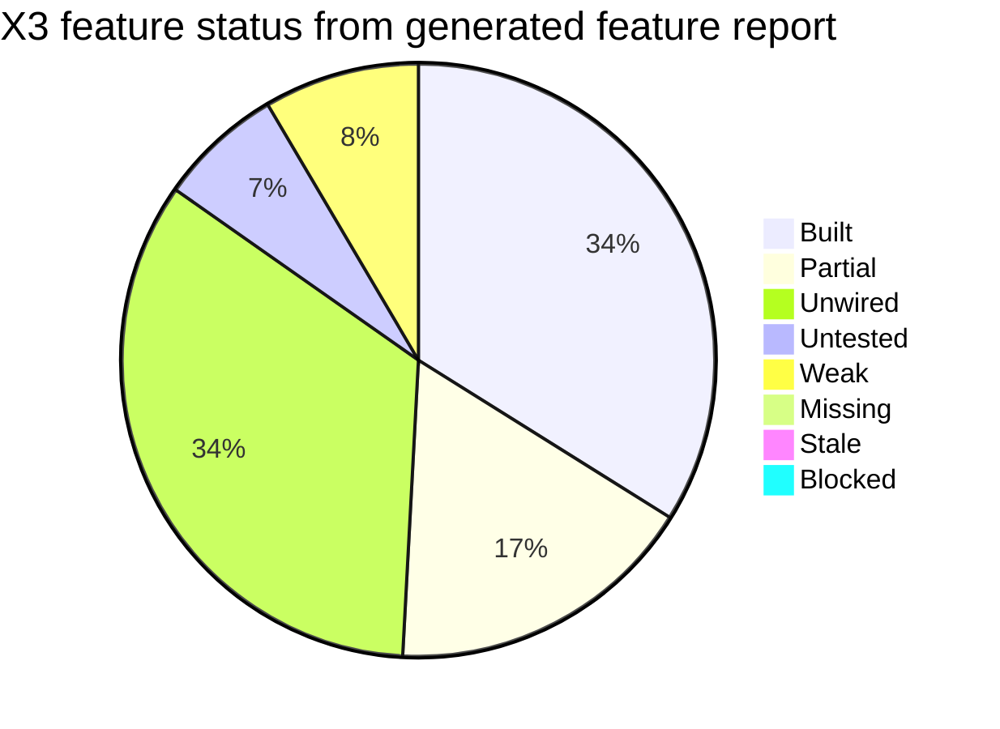
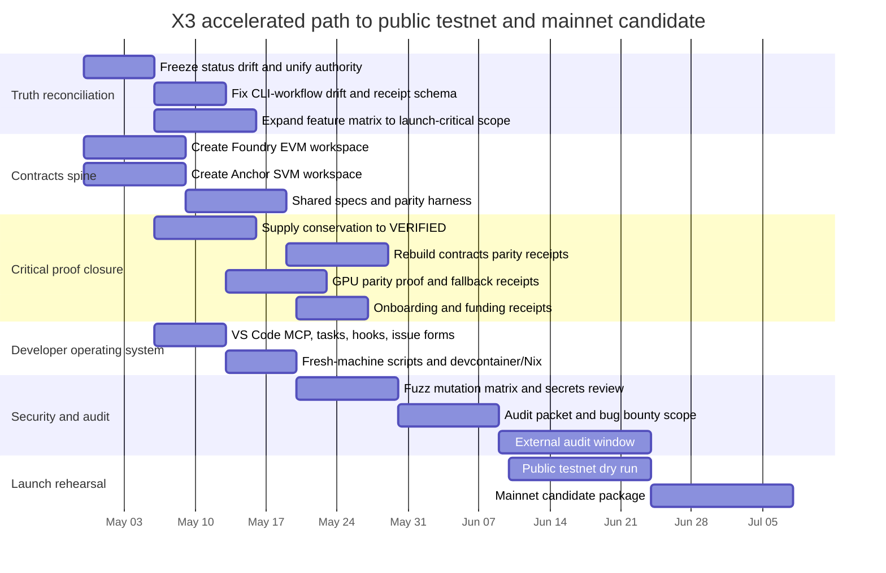

# X3 ProofForge and X3-Contracts Mainnet Build Report

## Executive Summary

The public repository on entity["company","GitHub","software platform"] already contains a substantial X3 monorepo: a large Rust workspace with node, runtime, pallets, many supporting crates, and a dedicated `proof-forge` CLI. The fastest useful path to mainnet is **not** a greenfield rebuild. It is a **truth-first stabilization program**: reconcile contradictory status artifacts, make ProofForge executable rather than heuristic, introduce a real `X3-contracts` EVM/SVM workspace, and close the remaining launch-blocking claims with reproducible receipts. fileciteturn40file0L1-L1 fileciteturn19file0L1-L1

The highest-confidence launch artifact in the repo is the machine-generated mainnet decision report dated April 27, 2026. It says **NO-GO**, **56% overall score**, **9/10 S0 verified**, with `x3.asset_kernel.supply_conservation` still launch-blocking. That should be treated as the current source of truth until a newer signed receipt supersedes it. fileciteturn46file0L1-L1

ProofForge exists, but the current implementation is not yet the fully rigorous “receipt-backed truth layer” you described. The feature scanner determines many statuses through file existence checks and `grep` heuristics, and the feature matrix explicitly admits that many areas are still abbreviated with placeholder entries despite the broader “200+ features” ambition. That means current green statuses can overstate actual completeness. fileciteturn20file0L1-L1 fileciteturn25file0L1-L1

The biggest structural gap is `X3-contracts`. The feature matrix expects `X3-contracts/evm/...`, `X3-contracts/svm/...`, and shared parity/spec directories, but the fetched proof receipt for `x3.contracts.evm_svm_parity` points instead to `x3-contracts/src/lib.rs`, which does not match the matrixed EVM/SVM layout. In practical terms: the contracts story is **not yet grounded in a real dual-stack contract workspace**. fileciteturn25file0L1-L1 fileciteturn28file0L1-L1

My recommendation is to treat the next build program as six tightly sequenced streams running in parallel: **truth reconciliation, contracts spine, critical proof closure, developer operating system, security/audit hardening, and launch rehearsal**. With an 8-person core team, this is realistically a **14–18 week** mainnet-candidate path, with public testnet possible in **6–8 weeks** if contracts scaffolding and proof gate drift are fixed immediately. That estimate assumes focused execution, no major redesigns of the runtime, and an external audit beginning as soon as the contracts/parity surface stabilizes. This schedule is aggressive, but materially safer than promising “ASAP mainnet” against the repo’s current recorded NO-GO state. fileciteturn46file0L1-L1

## Repository Inventory and Current State

### Assumptions

The plan below uses the following assumptions because they are not fully specified in the repository:

| Assumption | Working value |
|---|---:|
| Core implementation team | 8 people |
| Composition | 2 runtime/protocol, 1 ProofForge/QA, 1 EVM, 1 SVM/Anchor, 1 DevEx, 1 SRE/infra, 1 security/release |
| Loaded internal cost | $1,200 per person-day |
| Public testnet target | 6–8 weeks |
| Mainnet-candidate target | 14–18 weeks |
| GPU benchmark host | 1× NVIDIA L40S or A100, 32–64 vCPU, 128–256 GB RAM |
| Baseline CI host | 16–32 vCPU, 64–128 GB RAM, Ubuntu 22.04 |

### What the repo already has

The workspace manifest declares a large monorepo including `node`, `runtime`, many pallets, `x3-vm`, `x3-compiler`, `x3-flashloan`, `x3-dex`, `x3-gpu-validator-swarm`, `x3-proof`, and `proof-forge` itself. That is enough substrate to support the full X3 ProofForge + contracts program without splitting the codebase further. fileciteturn40file0L1-L1

The `x3-proof` CLI binary exists under `proof-forge`, and already exposes many of the right operational verbs: `verify`, `prove`, `prove-all`, `security-gate`, `hack`, `edge-case`, `limp`, `mainnet-gate`, `testnet-gate`, `dashboard`, `scan-claims`, `ai-patch-firewall`, `prove-everything`, `todo-gate`, `gap-gate`, and `features`. That means the right control plane shape is present. fileciteturn19file0L1-L1

There is already CI structure for build/test, proof-gates, and formal verification. The build workflow includes format, clippy, tests, coverage, audit, and advanced testing lanes. The proof-gates workflow runs claim scans, receipt verification, security gates, testnet/mainnet gates, and a daily proof run. The formal workflow provisions TLA+, Coq, K, and Dafny. fileciteturn22file0L1-L1 fileciteturn21file0L1-L1 fileciteturn23file0L1-L1

There is also an advanced test runner script that already codifies property testing, fuzzing, Kani, Loom, Shuttle, Miri, sanitizers, mutation testing, and integration smoke tests. That script should become the backbone of the “quick / strict / full” testing ladder rather than being treated as optional side tooling. fileciteturn33file0L1-L1

The `x3-cli` crate already has developer scaffolding for Solidity and Anchor templates, which is a major accelerant for `X3-contracts` onboarding. It can render Solidity contract stubs, Anchor program stubs, and Foundry tests. fileciteturn53file0L1-L1 fileciteturn55file0L1-L1

### What is not grounded enough yet

The generated feature report shows a **PARTIAL** verdict with a large share of features classified as unwired, untested, or weak. The matrix also says “remaining areas abbreviated for space” and explicitly acknowledges placeholder entries, which means the coverage model is not yet complete enough to support a strong “full stack proven” claim. fileciteturn18file0L1-L1 fileciteturn25file0L1-L1

The launch state and documentation are inconsistent. The README says “TESTNET ONLY” and “NOT READY FOR MAINNET,” but also contains broad “ready” phrasing; the discrepancy document says “all gates pass” in its header while preserving older sections that still describe unresolved S0/S1 issues; the gaps report claims there are no workflow files even though the repo now has multiple workflows. These inconsistencies are not cosmetic—they make public claims and internal planning unsafe. fileciteturn41file0L1-L1 fileciteturn42file0L1-L1 fileciteturn47file0L1-L1

The current feature scanner uses file existence, `grep`, and receipt freshness checks to determine a large portion of status. That is helpful for detection, but insufficient as a final verifier. A chain advertised as “proven” needs direct command execution, artifact hashing, and negative-result evidence—not only existence checks. fileciteturn20file0L1-L1

The contracts story is the thinnest part of the current stack. The matrix expects full `X3-contracts` EVM and SVM trees, but the current parity receipt inspects only `x3-contracts/src/lib.rs`, and the repo evidence collected here does not show a working Anchor workspace or a Foundry-based EVM contracts tree at the expected paths. That mismatch must be fixed before any EVM/SVM compatibility or “easiest onboarding” claim can be defended. fileciteturn25file0L1-L1 fileciteturn28file0L1-L1

The GPU proof path is promising but not yet publishable as a world-leading proof packet. The GPU benchmark tool hardcodes `gpu_available: true` and benchmarks only hashing-style deterministic tasks, which is not the same as proving validator-side correctness, chain-level throughput, or CPU/GPU state-root parity under realistic load. fileciteturn50file0L1-L1 fileciteturn52file0L1-L1

### Current status chart

The feature report currently records the repo as `PARTIAL`, not `BUILT`. The following chart is derived from the generated feature status report. fileciteturn18file0L1-L1



### Launch-critical feature-to-file mapping

The mapping below is the launch-critical slice that should become the initial burndown board. It is derived from the claim registry, feature matrix, mainnet report, receipts, and fetched code/workflow artifacts. fileciteturn45file0L1-L1 fileciteturn25file0L1-L1 fileciteturn46file0L1-L1 fileciteturn19file0L1-L1

| Feature | Required files | Required tests / receipts | Current status | Notes |
|---|---|---|---|---|
| Asset supply conservation | `pallets/x3-kernel/src/lib.rs`, `pallets/x3-supply-ledger/src/lib.rs`, `proof/claims/registry.yml` | invariant tests, cross-VM supply proof, fresh receipt | **BLOCKED** | Launch report says this is the single P0 launch blocker. |
| Bridge replay protection | `crates/x3-bridge/...` or bridge pallet paths, replay receipt | replay, nonce, duplicate reject, fresh receipt | **VERIFIED** | Good claim shape exists, but receipt should be rebound to exact source files. |
| Bridge finality verification | bridge verifier files, receipt | fake/stale/wrong-chain rejection, malformed-proof handling | **VERIFIED** | Keep, but add executable negative vectors to audit packet. |
| Atomic one terminal state | atomic kernel and orchestrator files | state machine tests, no partial commit receipt | **VERIFIED** | Good candidate for public proof packet. |
| Atomic rollback safety | atomic kernel rollback files | rollback/refund/failure-path tests | **VERIFIED** | Must also be exercised through EVM/SVM parity harness. |
| Flashloan repay-or-revert | `crates/x3-flashloan`, pallet | repay/revert/reentrancy tests, receipt | **VERIFIED** | Contract-facing proofs still need EVM/SVM contract layer. |
| X3VM determinism | `crates/x3-vm/...` | replay, state-root consistency, CPU/GPU parity adjunct | **VERIFIED** | Main proof exists; GPU extension still partial. |
| x3-lang compiler reproducibility | `crates/x3-compiler/...` | deterministic bytecode/ABI hash tests | **VERIFIED** | Strong foundation for contract SDK stories. |
| Governance proof-gated upgrade | governance pallet, launch gates | upgrade gate, timelock, migration proof | **VERIFIED** | One of the strongest current claims. |
| EVM/SVM parity | `X3-contracts/shared/...`, parity receipt | same behavior vectors across EVM + SVM | **PARTIAL / REVOKE-AND-REBUILD** | Current receipt binding does not match matrixed file layout. |
| EVM contracts core | `X3-contracts/evm/contracts/core`, scripts, tests | `forge test`, scripts, deployment receipts | **MISSING** | Must be created as a real Foundry workspace. |
| SVM programs core | `X3-contracts/svm/programs`, `Anchor.toml`, tests | `anchor test`, verifiable build, deploy receipt | **MISSING** | Must be created as a real Anchor workspace. |
| Shared specs and test vectors | `X3-contracts/shared/specs`, `shared/test-vectors` | parity vector generation and replay | **MISSING** | This is the bridge between EVM and SVM truth. |
| GPU CPU/GPU parity | `crates/x3-gpu-validator-swarm`, `crates/x3-vm` | correctness parity, fallback, deterministic state root | **PARTIAL** | Current benchmark tooling is insufficient for market claims. |
| Developer first value onboarding | quickstart docs, `x3-cli`, templates, measured onboarding receipt | time-to-first-value benchmark, success-rate metric | **PARTIAL** | Receipt itself says measured TTFV proof is still missing. |
| Funding milestone receipts | grant/funding docs in proof area | milestone-budget-deliverable-receipt linkage | **PARTIAL** | Claim exists, but needs a standing finance proof pack. |
| Evolution no regression | evolution crates + receipts | generation-over-generation improvement without S0/S1 regressions | **UNVERIFIED** | Should be downgraded to research track until evaluators exist. |
| ProofForge CLI and workflows | `proof-forge/src/main.rs`, `receipt.rs`, workflows | CLI unit tests, workflow smoke tests, signed receipts | **PARTIAL** | Existing workflows already drift from current CLI flags. |

## Prioritized Roadmap

### Core strategy

The repository is close enough that the right move is **consolidation and hardening**, not architectural churn. The work should run in six streams, with the first two starting immediately:

- **Truth reconciliation**
- **Contracts spine**
- **Critical proof closure**
- **Developer operating system**
- **Security and audit hardening**
- **Launch rehearsal and public reproducibility**

### Timeline

This timeline assumes the 8-person team model above and starts immediately.



### Effort and budget

| Stream | Primary owner | Person-days | Loaded cost |
|---|---|---:|---:|
| Truth reconciliation | ProofForge lead + release lead | 45 | $54,000 |
| Contracts spine | EVM lead + SVM lead | 80 | $96,000 |
| Critical proof closure | runtime lead + ProofForge lead | 120 | $144,000 |
| Developer operating system | DevEx lead | 40 | $48,000 |
| Security and audit hardening | security lead + SRE | 70 | $84,000 |
| Launch rehearsal and public repro | SRE + release lead + QA | 60 | $72,000 |
| External audit + bug bounty prep | security lead | 30 internal + external vendor | $36,000 internal + $180,000–$350,000 external |
| **Total** |  | **445** | **$534,000 internal + external audit** |

### Milestones that must turn green

| Milestone | Exit criteria |
|---|---|
| Ground truth locked | one authoritative status file, registry, matrix, workflows, and receipts all agree |
| Contracts spine present | `X3-contracts/evm`, `X3-contracts/svm`, `X3-contracts/shared` compile and test locally |
| Mainnet blocker cleared | `x3.asset_kernel.supply_conservation` turns VERIFIED in registry and launch report |
| Parity real, not symbolic | EVM + SVM shared vectors pass and bind to fresh receipts |
| DevEx ready | fresh-machine setup produces first deploy + first proof receipt |
| Public testnet ready | `x3-proof testnet-gate --fail-hard` and launch rehearsal pass |
| Mainnet candidate ready | external audit packet, bug bounty scope, launch report, and public repro packet complete |

## Delivery System and Developer Operating Model

### What to fix first in the repo’s own automation

The current formal verification workflow calls `x3-proof formal --workspace . --strict` and later `--report`, but the fetched CLI definition for `formal` does not expose either `--strict` or `--report`. That is a concrete example of drift between the designed control plane and the code that is supposed to enforce it, and it should be fixed before adding new workflows. fileciteturn23file0L1-L1 fileciteturn19file0L1-L1

The existing enforcement installer is useful as an idea, but it is currently scoped to a much narrower file map than the actual monorepo and writes CODEOWNERS and hook logic around `apps/blockchain-adapter` rather than the real launch-critical runtime, pallet, contract, and proof surfaces. It should be replaced with a generalized X3 manifest-driven hook generator. fileciteturn34file0L1-L1

### Repo-defined VS Code MCP manifest

This is a **repo custom manifest**, not a built-in VS Code schema. The goal is to give every engineer one palette of high-value compound actions.

```json
{
  "version": 1,
  "palettes": [
    {
      "id": "x3.quick",
      "label": "X3: Quick Proof Loop",
      "commands": [
        "cargo fmt --all",
        "cargo clippy --all-targets --all-features -- -D warnings",
        "cargo test -p proof-forge --lib",
        "./target/release/x3-proof todo-gate mainnet",
        "./target/release/x3-proof gap-gate mainnet",
        "./target/release/x3-proof features status"
      ]
    },
    {
      "id": "x3.contracts",
      "label": "X3: Contracts Full Check",
      "commands": [
        "cd X3-contracts/evm && forge test -vvv",
        "cd X3-contracts/evm && forge coverage",
        "cd X3-contracts/svm && anchor test",
        "cargo test -p x3-proof --test contracts_parity"
      ]
    },
    {
      "id": "x3.release",
      "label": "X3: Release Candidate Gate",
      "commands": [
        "cargo build -p proof-forge --release",
        "./target/release/x3-proof prove-everything --strict --fail-hard",
        "./target/release/x3-proof mainnet-gate --strict --fail-hard",
        "./target/release/x3-proof dashboard --output proof/reports/proofscore.json --detailed"
      ]
    }
  ]
}
```

### Recommended `tasks.json`

```json
{
  "version": "2.0.0",
  "tasks": [
    {
      "label": "x3: build proof-forge",
      "type": "shell",
      "command": "cargo build -p proof-forge --release",
      "problemMatcher": "$rustc"
    },
    {
      "label": "x3: quick",
      "type": "shell",
      "dependsOn": [
        "x3: build proof-forge"
      ],
      "command": "cargo fmt --all && cargo clippy --all-targets --all-features -- -D warnings && cargo test -p proof-forge --lib && ./target/release/x3-proof todo-gate mainnet && ./target/release/x3-proof gap-gate mainnet && ./target/release/x3-proof features status",
      "problemMatcher": []
    },
    {
      "label": "x3: prove everything",
      "type": "shell",
      "dependsOn": [
        "x3: build proof-forge"
      ],
      "command": "./target/release/x3-proof prove-everything --strict --fail-hard",
      "problemMatcher": []
    },
    {
      "label": "x3: forge test",
      "type": "shell",
      "command": "cd X3-contracts/evm && forge test -vvv",
      "problemMatcher": []
    },
    {
      "label": "x3: anchor test",
      "type": "shell",
      "command": "cd X3-contracts/svm && anchor test",
      "problemMatcher": []
    },
    {
      "label": "x3: parity harness",
      "type": "shell",
      "command": "cargo test -p proof-forge --test contracts_parity -- --nocapture",
      "problemMatcher": []
    }
  ]
}
```

### Recommended `launch.json`

```json
{
  "version": "0.2.0",
  "configurations": [
    {
      "name": "Debug proof-forge mainnet gate",
      "type": "lldb",
      "request": "launch",
      "cargo": {
        "args": [
          "build",
          "-p",
          "proof-forge"
        ]
      },
      "args": [
        "mainnet-gate",
        "--strict",
        "--fail-hard"
      ],
      "cwd": "${workspaceFolder}"
    },
    {
      "name": "Debug x3-chain-node dev",
      "type": "lldb",
      "request": "launch",
      "program": "${workspaceFolder}/target/release/x3-chain-node",
      "args": [
        "--chain",
        "dev",
        "--tmp",
        "--rpc-external"
      ],
      "cwd": "${workspaceFolder}"
    }
  ]
}
```

### Pre-commit hook

```bash
#!/usr/bin/env bash
set -euo pipefail

cargo fmt --all
cargo clippy --all-targets --all-features -- -D warnings
cargo test -p proof-forge --lib

if [[ -x ./target/release/x3-proof ]]; then
  ./target/release/x3-proof todo-gate mainnet
  ./target/release/x3-proof gap-gate mainnet
else
  cargo build -p proof-forge --release
  ./target/release/x3-proof todo-gate mainnet
  ./target/release/x3-proof gap-gate mainnet
fi
```

### Corrected GitHub Actions workflow for PRs

This should replace the drift-prone pieces of the current workflow set.

```yaml
name: X3 ProofForge PR Gate

on:
  pull_request:
    branches: [main, develop]
  push:
    branches: [main, develop]

env:
  CARGO_TERM_COLOR: always
  RUST_BACKTRACE: "1"

jobs:
  proof-pr:
    runs-on: ubuntu-latest
    timeout-minutes: 90

    steps:
      - uses: actions/checkout@v4
        with:
          fetch-depth: 0

      - uses: dtolnay/rust-toolchain@stable

      - uses: Swatinem/rust-cache@v2

      - name: Build proof-forge
        run: cargo build -p proof-forge --release

      - name: Rust hygiene
        run: |
          cargo fmt --all -- --check
          cargo clippy --all-targets --all-features -- -D warnings

      - name: ProofForge smoke
        run: |
          cargo test -p proof-forge --lib
          ./target/release/x3-proof todo-gate mainnet --fail-hard
          ./target/release/x3-proof gap-gate mainnet --fail-hard
          ./target/release/x3-proof features scan --fail-hard

      - name: Contracts matrix
        run: |
          if [ -d X3-contracts/evm ]; then
            (cd X3-contracts/evm && forge test -vvv)
          fi
          if [ -d X3-contracts/svm ]; then
            (cd X3-contracts/svm && anchor test --skip-build)
          fi

      - name: Upload proof reports
        if: always()
        uses: actions/upload-artifact@v4
        with:
          name: proof-reports
          path: |
            proof/reports/**
            proof/receipts/**
```

### Contracts-specific workflow

```yaml
name: X3 Contracts Matrix

on:
  pull_request:
    paths:
      - "X3-contracts/**"
      - "proof/features/feature_matrix.yml"
      - "proof/claims/registry.yml"
      - "proof-forge/**"

jobs:
  evm:
    runs-on: ubuntu-latest
    steps:
      - uses: actions/checkout@v4
      - name: Install Foundry
        run: curl -L https://foundry.paradigm.xyz | bash && ~/.foundry/bin/foundryup
      - name: EVM tests
        run: cd X3-contracts/evm && forge test -vvv && forge coverage

  svm:
    runs-on: ubuntu-latest
    steps:
      - uses: actions/checkout@v4
      - name: Install Anchor toolchain
        run: |
          cargo install --git https://github.com/coral-xyz/anchor avm --locked || true
          avm install latest && avm use latest
      - name: SVM tests
        run: cd X3-contracts/svm && anchor test

  parity:
    runs-on: ubuntu-latest
    steps:
      - uses: actions/checkout@v4
      - uses: dtolnay/rust-toolchain@stable
      - name: Parity harness
        run: cargo test -p proof-forge --test contracts_parity -- --nocapture
```

### GitHub issue template for missing proof

```yaml
name: Missing proof
description: Add or repair a missing X3 proof
title: "[proof] <claim_id> missing or stale"
labels: ["proof", "blocker"]
body:
  - type: input
    id: claim
    attributes:
      label: Claim ID
      placeholder: x3.asset_kernel.supply_conservation
    validations:
      required: true

  - type: textarea
    id: evidence
    attributes:
      label: Missing evidence
      placeholder: list tests, receipts, docs, and workflows that are missing
    validations:
      required: true

  - type: textarea
    id: files
    attributes:
      label: Required files
      placeholder: pallets/... proof/... X3-contracts/...
    validations:
      required: true

  - type: dropdown
    id: severity
    attributes:
      label: Severity
      options: ["S0", "S1", "S2", "S3"]
    validations:
      required: true
```

### PR checklist

```markdown
## X3 PR Checklist

- [ ] I updated `proof/claims/registry.yml` if claim status changed
- [ ] I updated `proof/features/feature_matrix.yml` if feature coverage changed
- [ ] I added or refreshed receipts for affected critical claims
- [ ] `cargo fmt --all` passes
- [ ] `cargo clippy --all-targets --all-features -- -D warnings` passes
- [ ] `./target/release/x3-proof todo-gate mainnet --fail-hard` passes
- [ ] `./target/release/x3-proof gap-gate mainnet --fail-hard` passes
- [ ] If contracts changed: `forge test` and/or `anchor test` passes
- [ ] If runtime or proof surfaces changed: launch reports were regenerated
- [ ] I did not weaken tests or broaden mocks without explicitly documenting why
- [ ] I attached benchmark or security evidence for any performance/security claim
```

### Concrete agent prompts

The repo needs **repeatable prompts** that force deliverables rather than vibes.

**Prompt for ProofForge claim closure**

```text
You are working in the X3 monorepo.
Goal: make claim <CLAIM_ID> genuinely VERIFIED.

Read:
- proof/claims/registry.yml
- proof/features/feature_matrix.yml
- proof-forge/src/main.rs
- proof-forge/src/receipt.rs
- launch-gates/reports/X3-MAINNET-GO-NO-GO-20260427-173325.md

Deliver:
1. exact code changes
2. exact tests to add
3. exact receipt command to generate
4. any workflow changes needed
5. a short risk note if the current claim should be downgraded instead of “fixed”

Constraints:
- do not weaken tests
- do not add mocks in critical paths
- prefer executable proofs over doc-only claims
- output patch plan first, then code
```

**Prompt for EVM contracts generation**

```text
Build `X3-contracts/evm` as a Foundry workspace for X3.
Create:
- src/core/
- src/security/
- script/deploy/
- script/upgrade/
- test/unit/
- test/integration/
- test/parity/

Implement:
- flashloan core with repay-or-revert invariant
- governance-gated upgrade helper
- smart-account onboarding contract for ERC-4337 compatibility
- parity vector loader from ../shared/test-vectors

Also generate:
- foundry.toml
- minimal README
- CI command list
- coverage command list

Do not stub deployment paths.
Every contract with state changes must have negative tests.
```

**Prompt for SVM programs generation**

```text
Build `X3-contracts/svm` as a real Anchor workspace.
Create:
- Anchor.toml
- programs/x3_core/
- tests/
- migrations/
- app/ optional placeholder only if needed

Implement:
- flashloan-style program invariant matching EVM behavior
- governance/upgrade authority checks
- event schema compatible with ../shared/schemas
- parity vec import from ../shared/test-vectors

Require:
- anchor test
- anchor build --verifiable
- anchor verify recipe
- account size correctness and discriminator handling
```

**Prompt for parity harness**

```text
Build a proof harness that runs the same shared vectors against `X3-contracts/evm` and `X3-contracts/svm`.
For each vector:
- run the EVM path
- run the SVM path
- normalize outputs and events
- compare state deltas, fees, errors, and terminal state
- emit a receipt JSON in proof/receipts/contracts/

If behavior differs:
- fail hard
- print minimized diff
```

**Prompt for onboarding proof**

```text
Create a fresh-machine onboarding benchmark for X3.

Measure:
- clone to first successful build
- first local node start
- first EVM contract deploy
- first SVM program deploy
- first parity harness pass
- first proof receipt generation

Output:
- machine profile
- timings
- pass/fail
- reproduction commands
- receipt JSON
```

## Proof, Benchmarking, and Reproducibility

### Recommended command ladder

The repo already has the right nouns; now it needs a stable, opinionated ladder. The commands below combine existing ProofForge verbs with official Foundry, Anchor, Solana, ERC-4337, and benchmarking guidance. Foundry supports test filtering, coverage, gas snapshots, scripting, and Anvil local-dev nodes; Hardhat remains useful for JS/TS integration and richer deployment orchestration; Anchor supports `build`, `test`, `deploy`, and verifiable builds; Solana guidance emphasizes local validator workflows and verified builds; ERC-4337 centers onboarding around `EntryPoint`, `simulateValidation`, bundlers, and paymasters. Chainspect tracks the exact public metrics X3 wants to market against—TPS, block time, finality, decentralization, and chain revenue—while DeFiLlama and entity["company","Token Terminal","crypto analytics platform"] provide the fees/revenue/economic definitions needed to make performance claims economically honest. citeturn2search2turn2search4turn2search7turn1search0turn3search0turn3search3turn1search2turn0search2turn0search4turn4search0turn5search3turn6search0

**Core repo loop**

```bash
cargo build -p proof-forge --release
cargo test -p proof-forge --lib
./target/release/x3-proof todo-gate mainnet --fail-hard
./target/release/x3-proof gap-gate mainnet --fail-hard
./target/release/x3-proof features scan --fail-hard
./target/release/x3-proof prove-everything --strict --fail-hard
./target/release/x3-proof dashboard --output proof/reports/proofscore.json --detailed
```

**Advanced repo loop**

```bash
./scripts/test-all-advanced.sh --ci --quick
./scripts/test-all-advanced.sh --thorough --with-fragile
cargo mutants --package x3-fees --list
cargo +nightly test -p x3-gateway --test loom_mempool_concurrency --features loom-tests -- --nocapture
cargo +nightly miri test -p x3-proof --lib
```

**EVM contracts loop**

```bash
cd X3-contracts/evm
forge test -vvv
forge coverage
forge snapshot
anvil --block-time 1
forge script script/deploy/Deploy.s.sol:Deploy --rpc-url http://127.0.0.1:8545 --broadcast
```

**SVM contracts loop**

```bash
cd X3-contracts/svm
anchor build
anchor test
anchor build --verifiable
solana-test-validator
anchor deploy
```

**Parity loop**

```bash
cargo test -p proof-forge --test contracts_parity -- --nocapture
./target/release/x3-proof verify x3.contracts.evm_svm_parity --strict
```

### Reproducible benchmark recipes

**Hardware profiles**

| Profile | Purpose | Minimum spec |
|---|---|---|
| H-dev | local correctness and iteration | 16 vCPU, 64 GB RAM, NVMe SSD, no GPU required |
| H-ci | deterministic CI and proof execution | 32 vCPU, 128 GB RAM, Ubuntu 22.04, NVMe SSD |
| H-gpu | GPU parity and throughput | 32–64 vCPU, 128–256 GB RAM, NVIDIA L40S/A100, recent CUDA driver |

**Recipe for contracts and runtime throughput**

```bash
# Start local EVM node
anvil --block-time 1 --dump-state .bench/anvil-state.json

# Start local Solana node
solana-test-validator --reset

# Start X3 dev node
./target/release/x3-chain-node --chain dev --tmp --rpc-external

# Run EVM workload
cd X3-contracts/evm && forge test --match-contract Bench* -vvv

# Run SVM workload
cd X3-contracts/svm && anchor test --skip-build

# Run X3 GPU bench
cargo run -p x3-gpu-validator-swarm --bin x3-swarm-bench -- run

# Run proof exporter
./target/release/x3-proof dashboard --output proof/reports/bench-proofscore.json --detailed
```

**What every public benchmark packet must include**

- workload definition
- command lines
- commit hash
- hardware
- validator count
- duration
- success/failure rate
- p50/p95/p99 latency
- finality definition
- correctness checks
- raw logs
- receipt hashes
- comparison baseline

That requirement is consistent with how public blockchain analytics platforms separate throughput, block time, finality, decentralization, and economic quality, and with how protocol analytics platforms define fees, revenue, cost of revenue, and earnings. citeturn4search0turn6search0turn6search4turn5search3

### Receipt template to standardize on

The current receipt type in `proof-forge/src/receipt.rs` has the right binding-hash concept and 24-hour freshness threshold. Keep that, but extend receipts to include machine profile, exact artifact list, and explicit limitations. fileciteturn48file0L1-L1

```json
{
  "receipt_id": "x3.contracts.evm_svm_parity.2026-05-15T18:30:00Z",
  "claim_id": "x3.contracts.evm_svm_parity",
  "repo_commit_hash": "REPLACE_ME",
  "command_run": "x3-proof verify x3.contracts.evm_svm_parity --strict",
  "policy_hash": "sha256:REPLACE_ME",
  "artifact_hash": "sha256:REPLACE_ME",
  "relevant_files": [
    "X3-contracts/evm/src/core/Flashloan.sol",
    "X3-contracts/svm/programs/x3_core/src/lib.rs",
    "X3-contracts/shared/test-vectors/flashloan_repay_or_revert.json",
    "proof/claims/registry.yml"
  ],
  "machine": {
    "os": "ubuntu-22.04",
    "cpu": "32 vCPU",
    "ram_gb": 128,
    "gpu": "NVIDIA L40S"
  },
  "result": {
    "status": "verified",
    "proof_level": "P9",
    "edge_case_level": "E9",
    "hack_level": "H9",
    "operator_level": "I8",
    "degraded_level": "D7",
    "commands_run": [
      "forge test -vvv",
      "anchor test",
      "cargo test -p proof-forge --test contracts_parity"
    ],
    "passed_checks": [
      "same terminal state on EVM and SVM",
      "same normalized event schema",
      "same fee outcome class"
    ],
    "failed_checks": [],
    "missing_proofs": [],
    "score": 0.98,
    "duration_ms": 312450
  },
  "limitations": [
    "Does not prove external third-party wallet UI rendering."
  ],
  "timestamp": "2026-05-15T18:30:00Z",
  "binding_hash": "sha256:REPLACE_ME"
}
```

### Exact next twenty commands to run locally

```bash
git checkout -b feat/proofforge-mainnet-program
cargo build -p proof-forge --release
cargo test -p proof-forge --lib
./target/release/x3-proof features status
./target/release/x3-proof todo-gate mainnet --fail-hard
./target/release/x3-proof gap-gate mainnet --fail-hard
./target/release/x3-proof claims
cat launch-gates/reports/X3-MAINNET-GO-NO-GO-20260427-173325.md
mkdir -p X3-contracts/evm/src/core X3-contracts/evm/test X3-contracts/evm/script
mkdir -p X3-contracts/svm/programs/x3_core/src X3-contracts/svm/tests X3-contracts/svm/migrations
mkdir -p X3-contracts/shared/specs X3-contracts/shared/test-vectors X3-contracts/shared/schemas
cp proof/features/feature_matrix.yml proof/features/feature_matrix.yml.bak
cp proof/claims/registry.yml proof/claims/registry.yml.bak
cargo run -p x3-cli -- init x3_contracts --template solidity || true
cargo run -p x3-cli -- init x3_svm_contracts --template anchor || true
curl -L https://foundry.paradigm.xyz | bash
~/.foundry/bin/foundryup
cargo install --git https://github.com/coral-xyz/anchor avm --locked || true
avm install latest && avm use latest
./scripts/test-all-advanced.sh --ci --quick
```

## Security, Audit, and Blocker Burn-Down

### Security checklist for launch

The repo already recognizes the right ingredients—receipt integrity, formal methods hooks, advanced testing lanes, and launch gates—but they need to be made coherent. Use this as the launch-security minimum. fileciteturn21file0L1-L1 fileciteturn22file0L1-L1 fileciteturn23file0L1-L1 fileciteturn48file0L1-L1

- Zero unresolved S0 claims in launch report
- All launch-critical receipts fresh and correctly bound to actual source files
- Real `X3-contracts` Foundry and Anchor workspaces, not symbolic placeholders
- EVM/SVM parity vectors in CI
- `anchor build --verifiable` and Solana verified-build recipe documented
- ERC-4337 smart account onboarding tested through bundler simulation and paymaster paths
- No workflow/CLI flag drift
- Fuzz, property, concurrency, mutation, and UB lanes must have at least one passing baseline on release candidates
- Governance upgrades must require proof receipts and migration evidence
- Fresh-machine reproduction packet must be published
- External audit packet and bug bounty scope prepared before mainnet candidate
- No public “top chain” marketing claim before reproducible benchmark receipt beats a named baseline and includes economics context

### Top blockers and burn-down plan

| Blocker | Evidence | Owner | Effort | Exit |
|---|---|---:|---:|---|
| Authoritative truth is split across contradictory docs | README, discrepancy doc, gaps report, launch report conflict | release lead | 5 pd | one `STATUS_CURRENT.md` generated from receipts |
| Supply conservation still launch-blocking | mainnet NO-GO report | runtime lead | 12 pd | claim turns VERIFIED and launch report score recalculates |
| `X3-contracts` tree not grounded | feature matrix vs current receipt mismatch | EVM + SVM leads | 20 pd | real workspaces compile and test |
| Contracts parity proof is misbound | parity receipt points to wrong target shape | ProofForge lead | 8 pd | old receipt revoked and replaced |
| Workflow/CLI drift | formal workflow uses unsupported flags | ProofForge lead | 3 pd | workflows pass dry-run and smoke tests |
| GPU proof packet too weak | benchmark hardcodes GPU presence and lacks real correctness claims | GPU lead | 10 pd | parity receipt + benchmark recipe + fallback proof |
| Onboarding proof is incomplete | current receipt says timing proof is missing | DevEx lead | 6 pd | measured onboarding receipt published |
| Feature matrix is under-scoped | matrix admits placeholders and abbreviated areas | ProofForge lead | 10 pd | launch-critical matrix expanded with owners/tests |
| External audit not yet productized | workflows and receipts exist but packet not assembled | security lead | 15 pd | audit packet + bug bounty scope published |

### How to handle AGI, evolution, and “world’s best” claims

Your earlier ambition around AGI, evolution, and “top chain” status should **not** be discarded, but it must be **reclassified**. The right model is to split ProofForge into:

- **Launch-critical tracked categories**: correctness, security, contracts parity, supply conservation, governance, ops, onboarding
- **Research categories**: AGI claims, autonomous evolution claims, self-improvement, major market-superiority claims

That approach mirrors how entity["company","OpenAI","ai company"] distinguishes tracked and research categories in its Preparedness Framework, how entity["organization","Google DeepMind","ai lab"] uses Critical Capability Levels and tracked capability levels in its Frontier Safety Framework, and how entity["organization","METR","ai evaluation nonprofit"] structures autonomy evaluations around task suites and explicit protocols. These are good templates for X3’s “research truth” lane: test dangerous or ambitious claims continuously, but do not let them contaminate mainnet readiness unless they become directly safety-relevant. citeturn7search0turn7search5turn8search1turn8search0

## Open Questions and Limitations

The report above is grounded in the repository artifacts fetched through the GitHub connector and a small number of primary external sources. I did **not** execute a full local build of the repository in this environment, so compile-time and runtime behavior are inferred from the repo’s own generated artifacts and workflow definitions rather than from a fresh machine run here. The highest-confidence repo facts are therefore the fetched workspace manifest, CLI source, feature matrix, feature report, claim registry, receipts, workflows, and launch report. fileciteturn40file0L1-L1 fileciteturn19file0L1-L1 fileciteturn25file0L1-L1 fileciteturn18file0L1-L1 fileciteturn45file0L1-L1 fileciteturn46file0L1-L1

I did not include a dedicated authoritative source for an ARC-specific safety framework in the final recommendations. That omission does not materially change the implementation plan because the launch-governance split between tracked and research categories is already well supported by the primary materials from OpenAI, METR, and Google DeepMind. citeturn7search0turn7search5turn8search1

The single biggest operational recommendation remains simple: **treat the April 27 launch report as the current source of truth, revoke any receipt or document that disagrees with it unless it is regenerated from code, and build `X3-contracts` for real before claiming the full X3 stack is proven.** fileciteturn46file0L1-L1