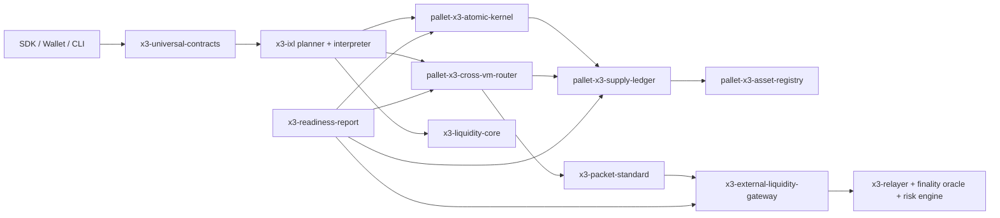
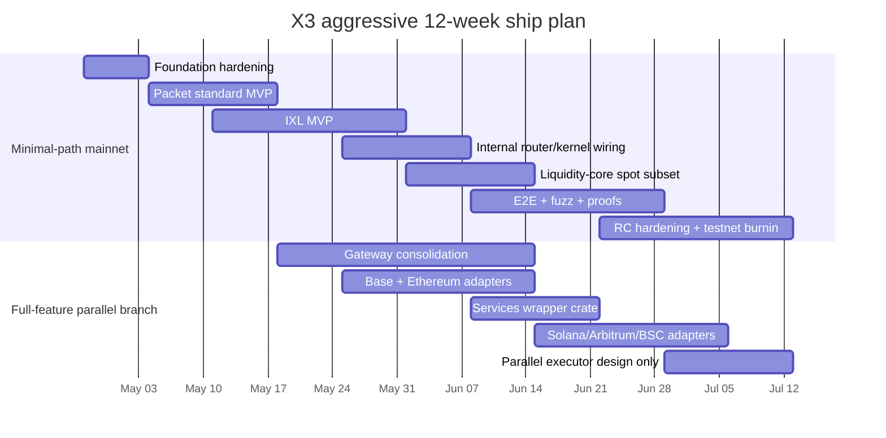

# X3 v0.4 ship plan for x3-atomic-star

## Executive summary

Enabled connector inventory for this research: entity["organization","GitHub","software hosting platform"] only.

The selected repo already has a serious Substrate-style core: `pallets/x3-kernel`, `pallets/x3-atomic-kernel`, `pallets/x3-asset-registry`, `pallets/x3-supply-ledger`, `pallets/x3-cross-vm-router`, `crates/x3-relayer`, `crates/x3-finality-oracle`, `crates/x3-gateway-risk-engine`, `crates/x3-packet-schema`, `crates/x3-intent`, and a large runtime workspace. The repo’s own planning docs describe roughly **101 crates + 31 pallets**, but the runtime manifest also explicitly says some pallets are still “staged” and not fully wired into the runtime, which matters more than raw crate count. fileciteturn42file0L1-L1 fileciteturn58file0L1-L1

The blunt truth is that the repo is **not close to full v0.4 mainnet**. It has good foundations, but key target modules are either missing, split across multiple crates, or present only as scaffolding. The biggest blockers are: no true `x3-ixl` instruction layer, no production-grade `x3-packet-standard` lifecycle crate, no `x3-parallel-executor`, no `x3-appzone-factory`, an effectively stubbed `x3-readiness-report`, partially stubbed external gateway logic, and a still-incomplete E2E and launch-gate story. The repo’s own “mainnet progress” JSON reports **12.4% overall**, while its E2E TODO still shows only **18/42 items completed** and many core integration tests not done. fileciteturn18file0L1-L1 fileciteturn56file0L1-L1

The fastest clean ship path is **not** “build everything at once.” The fastest clean ship path is to freeze scope around an **internal-only mainnet subset**: X3Native/X3Evm/X3Svm asset movement, one atomic bundle pipeline, one spot-swap path, minimal packet semantics, minimal IXL, hardened invariants, reproducible CI, and real readiness reporting. The external liquidity gateway, integrated services expansion, parallel executor, AppZone factory, and post-quantum integration should run as parallel or post-RC workstreams. That recommendation follows directly from the code: the current cross-VM router explicitly rejects non-internal routes and marks external bridge functions as Phase C stubs. fileciteturn27file0L1-L1

My realistic assessment today is:

- **Full X3 v0.4 to mainnet:** about **15% complete**
- **Minimal internal-only mainnet path:** about **35% complete**
- **Critical conclusion:** the repo contains enough substrate to ship a narrower, credible first mainnet if the team stops trying to boil the ocean. fileciteturn18file0L1-L1 fileciteturn27file0L1-L1 fileciteturn31file0L1-L1

## Repo audit and exact module map

The repo’s own roadmap is useful, but it is already partly stale. It says `x3-packet-standard` and `x3-readiness-report` are missing, while the current repo now contains `crates/x3-packet-schema` and `crates/x3-readiness-report`. That does **not** mean the target modules are finished; it means the code and the planning docs have drifted. The safe source of truth is the current code plus the runtime wiring status, not the slogans in status files. fileciteturn42file0L1-L1 fileciteturn29file0L1-L1 fileciteturn31file0L1-L1

| Target module | Current repo mapping | State now | Missing / duplicate / stubbed points | Exact file paths to add or modify | Evidence |
|---|---|---|---|---|---|
| Kernel | `pallets/x3-kernel/src/lib.rs`, `pallets/x3-atomic-kernel/src/lib.rs`, `pallets/x3-supply-ledger/src/lib.rs`, `pallets/x3-invariants/src/lib.rs` | **Strong base, not launch-ready** | Core logic exists; sampled pallets explicitly deny unsafe code. But supply-ledger still has a `FIXME` timestamp provider and a TODO on proof pruning; runtime manifest says some related pallets remain staged and wiring is still in progress. | Modify `runtime/Cargo.toml`, `runtime/src/lib.rs`, `pallets/x3-atomic-kernel/src/{lib.rs,tests.rs,weights.rs}`, `pallets/x3-supply-ledger/src/{lib.rs,tests.rs}` | fileciteturn24file0L1-L1 fileciteturn26file0L1-L1 fileciteturn45file0L1-L1 fileciteturn58file0L1-L1 |
| Asset registry | `pallets/x3-asset-registry/src/lib.rs` | **Good** | Clearly scoped and well-separated from balances and routing. Needs runtime/E2E hardening more than feature invention. | Modify `pallets/x3-asset-registry/src/tests.rs`; add integration tests under `tests/` | fileciteturn25file0L1-L1 |
| Account registry | No dedicated universal account registry. Closest pieces: `pallets/x3-domain-registry`, `pallet-agent-accounts`, sender/nonce logic in router/kernel | **Unspecified as a target module** | `x3-domain-registry` is a DNS/name pallet, not an account registry. Do not pretend otherwise. Either add a real account-registry module or de-scope the target. | Add `pallets/x3-account-registry/` **or** explicitly remove this from the v0.4 target matrix; if added, wire via `runtime/Cargo.toml` and `runtime/src/lib.rs` | fileciteturn44file0L1-L1 fileciteturn58file0L1-L1 |
| Liquidity-core | `crates/x3-dex`, `crates/x3-swap-router` | **Partial** | Plenty of trading code exists, but it is not a clean `x3-liquidity-core`. `x3-dex` starts by globally allowing dead code and unused imports; that is not what a mainnet-critical core should look like. `x3-swap-router` is ambitious, but it is a separate router stack, not yet a canonically wired liquidity core. | Create `crates/x3-liquidity-core/`; migrate or wrap `crates/x3-dex/src/*`; add `src/{launchpad.rs,anti_rug.rs,settlement.rs}`; update imports in runtime and downstream crates | fileciteturn39file0L1-L1 fileciteturn40file0L1-L1 |
| Packet-standard | Closest existing: `crates/x3-packet-schema/src/lib.rs` | **Partial, wrong level of abstraction** | `x3-packet-schema` provides VM packet wire formats and tests, but it does not implement the end-to-end packet lifecycle the v0.4 target needs: sequence semantics, acknowledgement, timeout, retry, refund, and replay handling across chains. | Add `crates/x3-packet-standard/{Cargo.toml,src/lib.rs,src/{packet.rs,replay.rs,timeout.rs,proof.rs},tests/,fuzz/}`; optionally add `pallets/x3-packet-registry/` | fileciteturn28file0L1-L1 |
| IXL | None | **Missing** | There is no dedicated cross-VM instruction interpreter/planner/receipt layer matching the target. Existing kernel bundles and intent types are related, but not the same thing. | Add `crates/x3-ixl/{Cargo.toml,src/{lib.rs,instruction.rs,planner.rs,interpreter.rs,rollback.rs,receipt.rs,verifier.rs},tests/}` | fileciteturn24file0L1-L1 fileciteturn59file0L1-L1 fileciteturn42file0L1-L1 |
| Cross-VM router | `pallets/x3-cross-vm-router`, `crates/cross-vm-bridge`, `crates/cross-vm-coordinator`, `crates/svm-integration`, `crates/evm-integration`, `crates/x3-vm` | **Useful base** | Internal X3Native/X3Evm/X3Svm routing exists and is the best current foundation. But the pallet explicitly rejects non-internal routes, and the bridge functions for external roots/pause are marked as Phase C stubs. | Modify `pallets/x3-cross-vm-router/src/{lib.rs,tests.rs,runtime_api.rs}`; later wire to `x3-ixl` | fileciteturn27file0L1-L1 fileciteturn46file0L1-L1 |
| Universal contracts | Closest existing: `crates/x3-intent`, `crates/x3-swap-router`, kernel bundle types | **Scattered** | Intent, routing, and atomic execution concepts exist in pieces, but there is no single developer-facing façade crate implementing the target action model. | Add `crates/x3-universal-contracts/{Cargo.toml,src/{lib.rs,actions.rs,intents.rs,sdk.rs,compiler.rs},tests/}`; wrap `x3-intent` rather than duplicating it | fileciteturn59file0L1-L1 fileciteturn40file0L1-L1 |
| External gateway | `crates/x3-relayer`, `crates/x3-finality-oracle`, `crates/x3-gateway-risk-engine`, router bridge-root functions, plus bridge crates referenced by roadmap | **Partial and unsafe to launch as-is** | Strong supporting pieces exist, but the relayer still uses placeholder zero values “in production, get from watcher,” and the router’s external proof path is not hardened. This is not a real multi-chain gateway yet. | Add `crates/x3-external-liquidity-gateway/{Cargo.toml,src/{lib.rs,ethereum.rs,base.rs,arbitrum.rs,bsc.rs,solana.rs,bitcoin.rs,watcher.rs,attestation.rs,refund.rs}}`; modify `crates/x3-relayer/src/{relayer.rs,watchers/*,submitter.rs}` | fileciteturn33file0L1-L1 fileciteturn34file0L1-L1 fileciteturn35file0L1-L1 fileciteturn27file0L1-L1 |
| Integrated services | `crates/x3-oracle`, `crates/x3-gateway-risk-engine`, `crates/x3-swap-router`, parts of relayer/sequencer | **Partial** | `x3-oracle` is basically a Pyth wrapper right now; there is no VRF, real automation scheduler, or formal keeper/job layer matching the feature set. | Add `crates/x3-integrated-services/{Cargo.toml,src/{lib.rs,oracle_net.rs,vrf.rs,automation.rs,keeper.rs,bridge_watchers.rs,risk_classifier.rs,route_optimizer.rs}}` | fileciteturn47file0L1-L1 fileciteturn34file0L1-L1 fileciteturn48file0L1-L1 |
| Parallel executor | None | **Missing** | No dedicated scheduler/conflict detector/deterministic parallel executor crate is present. | Add `crates/x3-parallel-executor/{Cargo.toml,src/{lib.rs,scheduler.rs,access_list.rs,conflict.rs,executor.rs,commit.rs},tests/}` | fileciteturn42file0L1-L1 |
| AppZone factory | None | **Missing** | No crate or CLI matching the target exists. | Add `crates/x3-appzone-factory/{Cargo.toml,src/{lib.rs,cli.rs,templates.rs,deploy.rs,registry.rs}}` | fileciteturn42file0L1-L1 |
| PQ | Closest existing: `crates/quantum-crypto` | **Partial, not integrated** | The crypto crate exists, but it globally allows dead code/unused items and is not visibly integrated with validator or account identity flows. | Rename or wrap into `crates/x3-pq/`; add trait-based integration in key management and validator identity code | fileciteturn49file0L1-L1 |
| Readiness report | `crates/x3-readiness-report` | **Stub** | The collector returns hard-coded `true` flags and zero values “in real implementation” rather than querying runtime state. That is a dashboard costume, not a readiness report. | Modify `crates/x3-readiness-report/src/{collector.rs,types.rs,formatter.rs,tests.rs}`; add `src/{kernel_checks.rs,gateway_checks.rs,consensus_checks.rs,invariants.rs}`; wire runtime/RPC reads | fileciteturn29file0L1-L1 fileciteturn30file0L1-L1 fileciteturn31file0L1-L1 |

### Concrete stubs, weak gates, and duplicated seams

| Finding | Why it matters | Evidence |
|---|---|---|
| `x3-readiness-report` is hard-coded | It will overstate readiness and hide real failures. | fileciteturn31file0L1-L1 |
| `x3-launch-validator` skips many live checks and reduces some checks to file existence | Good for scaffolding, bad as a launch gate. | fileciteturn37file0L1-L1 |
| `x3-genesis-builder` only validates and hashes a manifest | It is not a full genesis builder for deterministic chain launch. | fileciteturn38file0L1-L1 |
| `x3-relayer` contains placeholder “get from watcher” zeros for block hash/state root | That is a direct sign the external gateway path is unfinished. | fileciteturn33file0L1-L1 |
| `pallet-x3-cross-vm-router` external bridge functions are explicitly Phase C stubs | Multi-chain mainnet should not be built on top of stubbed bridge verification. | fileciteturn27file0L1-L1 |
| `x3-supply-ledger` still carries TODO/FIXME comments in core health paths | Supply correctness is sacred; TODOs there are launch blockers until closed or consciously de-scoped. | fileciteturn26file0L1-L1 |
| `x3-dex`, `x3-vm`, and `quantum-crypto` begin with broad `allow(dead_code/unused_*)` patterns | That usually means code volume is ahead of product discipline. | fileciteturn39file0L1-L1 fileciteturn46file0L1-L1 fileciteturn49file0L1-L1 |
| `launch-gates/run-all-proofs.sh` uses a hard-coded repo path and allows some failures with `|| true` | A command that can “pass while failing” is not a launch gate; it is theater. | fileciteturn55file0L1-L1 |
| E2E integration remains far from done | This is the biggest practical reason the repo is not mainnet-ready even where code exists. | fileciteturn56file0L1-L1 |

## Prioritized implementation plan

The repo already contains an internal roadmap estimating about **20 weeks** to complete the broader feature set. My recommendation is more aggressive, but only by cutting scope for the first ship and running two tracks in parallel: a **minimal-path mainnet track** and a **full-feature track**. Do not force the full gateway, services, parallel executor, AppZone factory, and PQ work into the same release train as the first credible launch candidate. fileciteturn43file0L1-L1

### Priority sprints and work packages

| Sprint | Goal | Exact tasks | Est. effort | Dependencies | Hard CI / test gate |
|---|---|---|---:|---|---|
| Foundation hardening | Make the current base honest and reproducible | Replace readiness-report stubs with real collectors; make launch-gates scripts portable; remove `|| true` from proof runner; add strict workspace build/test jobs; close supply-ledger FIXMEs or turn them into explicit de-scopes; wire missing staged pallets if they are in minimal scope | 3.0 person-weeks | None | `cargo check --workspace --all-targets`, `cargo clippy --workspace --all-targets -- -D warnings`, readiness-report integration test green |
| Packet standard MVP | Build the packet lifecycle layer the repo still lacks | Add `x3-packet-standard`; define packet IDs, sequence, receipt, acknowledgement, timeout, refund, proof hash; add packet registry or router integration; derive packet commits from domain-separated fields | 4.5 person-weeks | Foundation hardening | Fuzz targets, packet round-trip tests, replay/timeout property tests |
| IXL MVP | Build the missing execution plane | Add `x3-ixl`; define minimal opcodes for `Lock`, `Mint`, `Burn`, `Swap`, `Settle`, `EmitProof`, `Refund`, `Abort`; implement planner, interpreter, receipt, rollback | 6.0 person-weeks | Packet standard MVP | Serial replay equivalence, rollback correctness, cross-VM happy/failure path tests |
| Internal mainnet flow | Get one real path to production quality | Wire atomic-kernel + supply-ledger + cross-vm-router + IXL + one spot-swap path; restrict mainnet scope to X3Native/X3Evm/X3Svm only; make external gateway feature-gated and paused | 4.0 person-weeks | IXL MVP | End-to-end swap bundle tests, invariants, state reconciliation, fault-injection |
| Liquidity-core consolidation | Cleanly package trading for the first ship | Create `x3-liquidity-core`; migrate or wrap `x3-dex` components needed for spot AMM + settlement only; gate perpetuals and nonessential features | 3.5 person-weeks | None for refactor; needed before production swap | Spot swap tests, slippage tests, settlement invariant tests |
| Readiness and launch gates | Replace theater with evidence | Real readiness report; hard launch validator checks; add build fingerprinting, genesis determinism checks, runtime upgrade checks, try-runtime and benchmark jobs | 3.0 person-weeks | Foundation hardening | Try-runtime, pallet benchmarks, hazard scan, launch checklist green |
| Full gateway branch | Start full-feature work without blocking mainnet RC | Consolidate relayer/finality/risk into `x3-external-liquidity-gateway`; implement Base/Ethereum first, then Solana/Arbitrum/BSC; formal attestation quorum; refunds and pause logic | 8.0 person-weeks | Packet standard MVP; partial IXL | Multi-chain replay tests, stale proof rejection, chain-id mismatch tests |
| Services branch | Wrap existing pieces into coherent services | Build `x3-integrated-services` around oracle, keeper, automation, route optimizer, risk classifier; add VRF only if there is a real first customer | 4.0 person-weeks | None for wrappers | Service health tests, mocked external feed tests |
| Deferred optimization | Do not put the rocket booster on before the wheels are attached | Build `x3-parallel-executor` only after the serial engine is proven stable; defer AppZone and PQ integration until after the minimal-path RC | 0 in minimal path; 6.0 later | Stable serial semantics | Parallel-vs-serial state root equivalence |

### Minimal first seven-day sprint with concrete PR targets

| PR target | Scope | Exact files |
|---|---|---|
| `pr/ci-harden-workspace` | Turn the repo into a strict, reproducible build instead of a vibes-based build | Modify `.github/workflows/*`, `tests_core/run-all.sh`, `launch-gates/run-all-proofs.sh`, `launch-gates/embarrassment-scan.sh` fileciteturn53file0L1-L1 fileciteturn54file0L1-L1 fileciteturn55file0L1-L1 |
| `pr/readiness-report-real-data` | Replace stubs with actual runtime/state collection | Modify `crates/x3-readiness-report/src/{collector.rs,types.rs,formatter.rs,tests.rs}`; add `src/{kernel_checks.rs,gateway_checks.rs,consensus_checks.rs,invariants.rs}` fileciteturn31file0L1-L1 |
| `pr/packet-standard-skeleton` | Add missing packet lifecycle crate | Add `crates/x3-packet-standard/{Cargo.toml,src/lib.rs,src/{packet.rs,replay.rs,timeout.rs,proof.rs},tests/}` |
| `pr/ixl-mvp-skeleton` | Add minimal execution plane | Add `crates/x3-ixl/{Cargo.toml,src/{lib.rs,instruction.rs,planner.rs,interpreter.rs,receipt.rs,rollback.rs},tests/}` |
| `pr/internal-mainnet-scope-freeze` | Make the ship scope explicit and disable wishful thinking | Modify `pallets/x3-cross-vm-router/src/lib.rs`, `runtime/Cargo.toml`, `runtime/src/lib.rs`, `STATUS_AUDIT_2026_04_27.md`, `web/mainnet-progress/data/mainnet_goals.json` to reflect internal-only RC scope and paused external gateway path fileciteturn27file0L1-L1 fileciteturn58file0L1-L1 fileciteturn18file0L1-L1 |

## Minimal path to mainnet and parallel full-feature path

The design I would ship is a narrow one first and a broad one second. In practical terms, that means adopting an IBC-style packet lifecycle with explicit sequence numbers, receipts, acknowledgements, and timeout/refund semantics, then layering a thin instruction interpreter over the existing internal router and ledgers. That model is already battle-tested in entity["organization","Cosmos","interchain ecosystem"] IBC: packet commitments, receipts, acknowledgements, and timeout callbacks are there for a reason. citeturn3search0turn3search1turn3search2



### Path comparison

| Path | What ships | What does **not** ship in the first release | Required tests, audits, and readiness gates |
|---|---|---|---|
| **Minimal fast-to-mainnet** | Internal X3Native/X3Evm/X3Svm routing only; one canonical asset family; one atomic bundle lifecycle; one spot-swap path; `x3-packet-standard` MVP; `x3-ixl` MVP; real readiness-report; hard CI/launch gates | No public external liquidity gateway, no multi-chain mint/burn bridge, no parallel executor, no AppZone factory, no PQ integration, no launchpad/perpetuals | Runtime audit on kernel/router/ledger; invariant audit; E2E happy-path and failure-path tests; state reconciliation; try-runtime upgrade checks; pallet benchmarks; fuzzing for packet parser and IXL interpreter; operational runbooks; go/no-go review |
| **Parallel full-feature path** | External gateway consolidation; Base/Ethereum first, then Solana/Arbitrum/BSC; unified universal-contracts façade; services wrapper crate; later parallel executor; later AppZone factory; later PQ integration | Nothing, eventually — but not all in the same train as the first mainnet RC | Separate bridge/gateway audit; cryptographic attestation review; external watcher/relayer chaos testing; replay/stale proof/chain-id mismatch tests; then parallel-vs-serial equivalence before any executor release |

The reason to hold `x3-parallel-executor` until after serial correctness is simple: the accepted design pattern for parallel blockchain execution is deterministic equivalence to a preset serial order. That is exactly the constraint emphasized by the Block-STM work now associated with entity["organization","Aptos","blockchain platform"]: speculative parallelism is acceptable only when the final result remains consistent with ordered execution. citeturn8search12

## Completion assessment

The repo’s own progress artifact reports **12.4% overall mainnet progress**. I consider that roughly directionally correct for the **full v0.4 superset**, not for the narrower internal-only path. My working estimate is **~15% complete toward full v0.4 mainnet** and **~35% complete toward a minimal internal-only mainnet path**. That difference comes from one fact: the internal kernel/ledger/router stack is materially ahead of the gateway/services/parallel-executor layer. fileciteturn18file0L1-L1 fileciteturn27file0L1-L1

### Per-module completion estimates

These percentages are an inference from code presence, wiring, stub density, and test depth. They are not a claim that any percentage can be spent at the bank.

| Module | Completion now | Why |
|---|---:|---|
| Kernel | **70%** | Real pallets exist for kernel, atomic bundle orchestration, supply accounting, and invariants, but runtime integration and launch-evidence discipline are still incomplete. fileciteturn24file0L1-L1 fileciteturn26file0L1-L1 fileciteturn45file0L1-L1 |
| Asset registry | **75%** | Clear palette of responsibilities and good separation from balances/routing. Mostly needs integration and testing. fileciteturn25file0L1-L1 |
| Account registry | **unspecified** | No dedicated universal account-registry implementation surfaced; `x3-domain-registry` is DNS/name service, not this target. fileciteturn44file0L1-L1 |
| Liquidity-core | **45%** | A lot of trading code exists, but it is not yet a disciplined, canonical module for mainnet scope. fileciteturn39file0L1-L1 fileciteturn40file0L1-L1 |
| Packet-standard | **25%** | `x3-packet-schema` covers packet structure and tests, but not the packet lifecycle needed for cross-chain safety. fileciteturn28file0L1-L1 citeturn3search0turn3search1 |
| IXL | **0%** | No dedicated crate matching the target exists. fileciteturn42file0L1-L1 |
| Cross-VM router | **65%** | Internal routing base is workable; external routes are explicitly not supported yet. fileciteturn27file0L1-L1 |
| Universal contracts | **20%** | Intent/action pieces exist in `x3-intent` and router code, but no unified façade. fileciteturn59file0L1-L1 |
| External gateway | **30%** | Relayer, finality oracle, and risk engine exist; actual secure bridge path is still partial and stubbed. fileciteturn33file0L1-L1 fileciteturn34file0L1-L1 fileciteturn35file0L1-L1 |
| Integrated services | **25%** | Oracle/risk/optimizer fragments exist, but not the integrated product. fileciteturn47file0L1-L1 fileciteturn34file0L1-L1 |
| Parallel executor | **0%** | No dedicated executor crate surfaced. fileciteturn42file0L1-L1 |
| AppZone factory | **0%** | No implementation surfaced. fileciteturn42file0L1-L1 |
| PQ | **15%** | `quantum-crypto` exists, but it is not visibly integrated into live account/validator flows. fileciteturn49file0L1-L1 |
| Readiness report | **10%** | The crate exists; the collector is still hard-coded. fileciteturn31file0L1-L1 |

## Risks, CI gates, tests, and benchmarks

### Major risks and mitigations

| Risk / blocker | Impact | Mitigation |
|---|---|---|
| Planning docs and current code have drifted | Teams implement the wrong thing or believe a missing module already exists | Freeze a single audited target matrix in `docs/v0_4_ship_scope.md`; treat code + runtime wiring as truth |
| Repo has launch-gate theater | False confidence, ugly launch-day surprises | Make all launch-gate scripts portable and fail-closed; remove path hardcoding and `|| true`; publish evidence artifacts per commit |
| No production-grade packet lifecycle | Replay, timeout, refund, and ack logic remain ad hoc | Implement `x3-packet-standard` before any external gateway work |
| No IXL | Cross-VM execution remains scattered across kernels, router, and intents | Build a minimal interpreter/planner/receipt layer, then expand |
| Runtime wiring incomplete | “Existing crate” does not equal “shipping feature” | Close staged-pallet gap in runtime manifest and runtime lib before feature claims |
| E2E and chaos coverage incomplete | Mainnet fails on composition, not on unit tests | Make E2E internal mainnet path a release blocker |
| Gateway verification incomplete | External liquidity launch could become a security event | Keep external gateway paused/off in the first mainnet release |
| Over-scope | The team spends 12 weeks everywhere and arrives nowhere | Split tracks: minimal-path release versus full-feature branch |

### Mandatory automated tests, fuzzing, and formal proofs before mainnet

The correct pattern here is straightforward: property tests plus fuzzing plus formal proofs plus runtime upgrade simulation. Property-based testing is a strong fit for packet lifecycles and ledger invariants, while `cargo-fuzz` is the standard Rust libFuzzer workflow, and Kani is an appropriate model checker for proving selected invariants and panic-freedom on small critical modules. Official Substrate-style launch discipline should also include `try-runtime` and pallet benchmarking. citeturn7search8turn4search0turn5search0turn5search1turn6search0turn6search1

| Category | Must add before mainnet | Concrete targets |
|---|---|---|
| Property tests | Supply invariants, refund invariants, packet state machine monotonicity, receipt determinism | `pallets/x3-supply-ledger`, `crates/x3-packet-standard`, `crates/x3-ixl` |
| Coverage-guided fuzzing | Packet parse/decode, packet replay map, IXL instruction decoding, rollback edge cases, router message handling | `crates/x3-packet-standard/fuzz/*`, `crates/x3-ixl/fuzz/*` |
| Model checking / formal proofs | No panic on packet lifecycle; impossible illegal transitions; rollback restores pre-state; bounded arithmetic and idempotency properties | Kani harnesses under `crates/x3-packet-standard/src/verification/` and `crates/x3-ixl/src/verification/` |
| Runtime simulation | Runtime upgrade migration, `try_state` checks, execute-block replay, offchain worker. | Runtime + pallets with try-runtime hooks |
| Benchmarks | Weight generation for every pallet in minimal scope | `pallets/x3-asset-registry`, `pallets/x3-supply-ledger`, `pallets/x3-cross-vm-router`, `pallets/x3-atomic-kernel`, `pallets/x3-invariants` |
| E2E | Internal asset transfer, swap, refund, emergency halt, restart/recovery, replay rejection | `tests/e2e/` or dedicated `x3-e2e` crate |
| Fault injection | Relayer loss, delayed packet, stale proof, chain-id mismatch, partial execution failures | Gateway branch and minimal-path replay/refund tests |
| Operations | Genesis determinism, node restart, backup/restore, alert routing, paused-chain runbooks | `testnet/`, `scripts/`, `launch-gates/` |

### Recommended CI and launch-gate commands

Use the repo’s existing test runner and hazard scanner as starting points, but tighten them into blocking checks. The repo already has `tests_core/run-all.sh` and `launch-gates/embarrassment-scan.sh`; keep them, but turn them into hard gates and make the proof runner path-independent. fileciteturn53file0L1-L1 fileciteturn54file0L1-L1 fileciteturn55file0L1-L1

```bash
cargo fmt --all -- --check
cargo clippy --workspace --all-targets -- -D warnings
cargo check --workspace --all-targets
cargo test --workspace --lib --tests -- --test-threads=1

cargo test -p pallet-x3-asset-registry
cargo test -p pallet-x3-supply-ledger
cargo test -p pallet-x3-cross-vm-router
cargo test -p pallet-x3-atomic-kernel
cargo test -p pallet-x3-invariants

cargo test -p x3-packet-standard
cargo test -p x3-ixl
cargo test -p x3-liquidity-core
cargo test -p x3-readiness-report

cargo build --release -p x3-chain-node --features try-runtime,runtime-benchmarks
try-runtime --runtime target/release/wbuild/x3-chain-runtime/x3_chain_runtime.compact.compressed.wasm \
  on-runtime-upgrade live --uri ws://127.0.0.1:9944

cargo fuzz run packet_decode
cargo fuzz run packet_replay
cargo fuzz run ixl_sequence
cargo fuzz run ixl_rollback

cargo kani -p x3-packet-standard --tests
cargo kani -p x3-ixl --tests

bash tests_core/run-all.sh
bash launch-gates/embarrassment-scan.sh
```

### Readiness metrics and benchmarks

| Metric | Why it matters | Release threshold |
|---|---|---|
| Throughput internal transfers | Measures minimal-path usable capacity | Sustained target defined by hardware, but prove stable plateau rather than cherry-picked peak |
| Atomic bundle latency p50/p95/p99 | Real user-facing experience | Stable under burst load with no invariant break |
| Packet replay rejection rate | Confirms dedup works | 100% rejection of duplicates in test corpus |
| Timeout/refund correctness | Protects user funds | 100% pass across synthetic delay/failure scenarios |
| Final state root equivalence | Required before any parallel executor work | Serial execution and replay/state reconstruction must match exactly |
| Invariant violation count | Economic safety | Zero in green-path and stress-path release candidates |
| Runtime upgrade pass rate | Avoids self-inflicted chain death | 100% for supported upgrade scenarios |
| External proof rejection rate | Gateway safety | 100% rejection of stale/bad chain-id/low-quorum proofs |
| Node restart recovery time | Operational resilience | Bounded and documented; no ledger corruption |
| Resource usage | Prevents hidden operational costs | p95 CPU/RAM/disk within operator SLO budgets |

## Aggressive twelve-week schedule

The week-by-week plan below assumes one release manager, one runtime lead, two protocol engineers, one bridge engineer, one QA/fuzz engineer, one DevOps/SRE engineer, and one security engineer shared across reviews.



| Week | Owners | Deliverables | Exit gate |
|---|---|---|---|
| Week of Apr 27 | Release manager, runtime lead, DevOps/SRE | Scope freeze, CI hardening, launch-gate cleanup, readiness-report rewrite started | Workspace builds cleanly; no non-portable path assumptions in launch scripts |
| Week of May 4 | Protocol engineer, security engineer | `x3-packet-standard` crate skeleton, packet IDs, sequence/replay map | Packet unit tests and basic fuzz targets green |
| Week of May 11 | Protocol engineer, runtime lead | Packet timeout/refund/ack semantics and first router integration; `x3-ixl` crate skeleton | Replay, timeout, and refund property tests green |
| Week of May 18 | Protocol engineer, QA/fuzz engineer, bridge engineer | IXL interpreter + receipt + rollback; gateway consolidation branch created | IXL happy path and rollback tests pass |
| Week of May 25 | Runtime lead, protocol engineer | Internal-only mainnet path wired end-to-end through kernel/router/ledger; gateway still explicitly disabled | Internal transfer + refund E2E green |
| Week of Jun 1 | Product engineer, protocol engineer | `x3-liquidity-core` spot subset with one swap path; perpetuals gated out | Swap E2E and settlement invariants green |
| Week of Jun 8 | QA/fuzz engineer, security engineer | Coverage-guided fuzzing, property tests, first Kani proofs, first try-runtime runs | No critical fuzz crashes; proofs pass on targeted harnesses |
| Week of Jun 15 | Bridge engineer, DevOps/SRE | Base/Ethereum gateway branch maturing; testnet infra and runbooks hardened for minimal path | Minimal path testnet stable for burn-in |
| Week of Jun 22 | Runtime lead, QA/fuzz engineer | Release candidate for minimal mainnet subset; launch validator upgraded from scaffolding to real gate | RC checklist green, no P0/P1 findings outstanding |
| Week of Jun 29 | Release manager, security engineer | External audit fixes for minimal path; full-path gateway branch continues | Audit P0s closed |
| Week of Jul 6 | Bridge engineer, product engineer | Solana/Arbitrum/BSC branch work and integrated-services wrapper branch | Full-feature branch compiles and basic tests pass |
| Week of Jul 13 | Release manager, all leads | Go/no-go decision for minimal mainnet; publish evidence, benchmarks, and runbooks | Signed launch package or explicit no-go |

### Open questions and limitations

A few things remain genuinely uncertain from the repo snapshot and I am not going to fake confidence where the evidence is thin.

The exact `runtime/src/lib.rs` pallet wiring was not exhaustively line-audited here, so the report relies on the runtime manifest’s explicit “staged-pallets” comment rather than claiming a full constructive-runtime map. fileciteturn58file0L1-L1

The repo contains contradictory self-reporting: high-confidence status docs exist next to critical discrepancy docs and large unfinished TODO lists. For launch decisions, trust code, strict CI, and E2E evidence over repo cheerleading. fileciteturn10file0L1-L1 fileciteturn11file0L1-L1 fileciteturn56file0L1-L1

If the product requirement is truly “full v0.4 feature set on first mainnet,” the 12-week plan is too aggressive. If the requirement is “credible first mainnet with a minimal but real atomic cross-VM core,” the 12-week plan is hard but realistic. The repo, as it stands, is much closer to the second goal than the first.