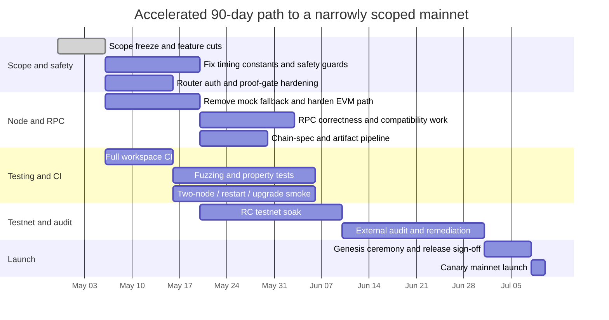

# Mainnet Readiness Assessment of Cyptopimpinainteazy/x3-atomic-star

## Executive summary

This assessment is based primarily on the code and repository documents in the specified repo on entity["company","GitHub","code hosting platform"]. The project is **not ready for a conservative public mainnet** today, but it is also **far beyond a skeleton**: the workspace contains a sovereign-chain runtime and node, a substantial multi-VM kernel, an internal cross-VM router, a settlement engine, governance and treasury pallets, proof tooling, CI workflows for proof gates, deployment/runbooks, dependency policy, and reproducible toolchain pinning. In other words, this is a serious build with real implementation breadth, not just a design repo. fileciteturn5file0L1-L1 fileciteturn34file0L1-L1 fileciteturn37file0L1-L1 fileciteturn16file0L1-L1 fileciteturn18file0L1-L1 fileciteturn47file0L1-L1 fileciteturn48file0L1-L1

The blocker is not lack of code volume. The blocker is that **several safety-significant surfaces are still either inconsistent, under-hardened, or explicitly partial**. The most important ones are: the runtime targets **200 ms blocks** but still contains many governance/operational periods copied from an earlier **6 s/block** model, which makes several real-world safety windows far shorter than the comments imply; the runtime keeps `RequireCrossVmProof = false`; the internal router temporarily disables sender authorization in `xvm_transfer`; the node keeps placeholder services for the sidecar and GPU-health logic; the public EVM RPC surface is only partly real, with `eth_call` returning an empty result and `eth_estimateGas` using a heuristic fallback; and the runtime leaves session/offence-style finality hardening incomplete, including disabled GRANDPA equivocation reporting and a dummy session handler. fileciteturn34file0L1-L1 fileciteturn41file0L1-L1 fileciteturn37file0L1-L1 fileciteturn39file0L1-L1

There are also strong positives. The internal router is carefully written around storage-transaction atomicity, packet commitments, replay protection, and explicit lifecycle tests. The settlement engine has real code and a large dedicated test file. The proof-forge harness and its CI workflows are real and useful, even if they should be treated as **structured proof/test gates**, not as a substitute for true formal verification or an external audit. The repo also carries launch runbooks, a cargo-deny policy, and an exact pinned Rust toolchain. fileciteturn41file0L1-L1 fileciteturn42file0L1-L1 fileciteturn10file0L1-L1 fileciteturn11file0L1-L1 fileciteturn16file0L1-L1 fileciteturn17file0L1-L1 fileciteturn20file0L1-L1 fileciteturn35file3L1-L1 fileciteturn35file4L1-L1 fileciteturn35file5L1-L1 fileciteturn47file0L1-L1 fileciteturn48file0L1-L1

My bottom-line inference is this:

| Release posture | Assumed scope | Estimated closeness | Verdict |
|---|---|---:|---|
| Conservative public mainnet | Public, adversarial, externally audited, no hidden footguns | **30–40%** | Not ready |
| Moderate internal-only mainnet | Authority-operated sovereign chain, **external bridges off**, experimental paths off | **55–65%** | Reachable with focused hardening |
| Aggressive canary launch | Narrow canary, restricted operators, experimental features mostly disabled | **70%+** | Technically plausible, but I would not call it “mainnet-grade” |

Those percentages are an engineering inference from the current code and repo artifacts, not a claim stated by the project itself. The repo’s own status documents are internally inconsistent: one says launch gates are green while another still flags unresolved gaps, and the code supports the more cautious reading. fileciteturn6file0L1-L1 fileciteturn15file0L1-L1 fileciteturn34file0L1-L1 fileciteturn37file0L1-L1 fileciteturn39file0L1-L1 fileciteturn41file0L1-L1

## Readiness verdict and assumptions

The codebase is built as a **sovereign Substrate-style chain** rather than a parachain: the runtime is composed around Aura and GRANDPA, and the node service starts Aura authoring and GRANDPA voting directly. That matters because the launch bar is not “ship a pallet,” it is “ship a full chain.” fileciteturn34file0L1-L1 fileciteturn37file0L1-L1

Because you did not specify target chain, risk tolerance, team, or budget, I used these explicit assumptions for the roadmap:

The **minimal viable mainnet scope** I recommend is: native balances and transaction payment; governance and treasury; X3 kernel; asset registry and supply ledger; internal X3Native/X3Evm/X3Svm routing; the settlement engine for controlled counterparties; standard Aura/GRANDPA operation; runbooks and signed genesis artifacts. I do **not** recommend including external bridges, flash finality, PoH, GPU-validator paths, or AI proposal execution in the first mainnet scope. The code already supports that scoped-down posture because the router explicitly freezes the external bridge surface by default, the node feature flags default experimental paths off, and several experimental subsystems are clearly marked incomplete or placeholder. fileciteturn41file0L1-L1 fileciteturn37file0L1-L1 fileciteturn43file0L1-L1

Under a **conservative release strategy**, the project should launch only after correcting timing/configuration mismatches, hardening consensus/session behavior, removing or scoping out placeholder node paths, fixing RPC correctness, tightening cross-VM authorization/proof requirements, expanding CI and fuzzing, and completing at least one external security audit cycle. Under a **moderate strategy**, the project can target an authority-operated internal-only mainnet or restricted production network with external bridges and experimental planes disabled. Under an **aggressive strategy**, a canary network could launch faster, but doing so would trade away the very thing “mainnet readiness” is supposed to mean. fileciteturn34file0L1-L1 fileciteturn37file0L1-L1 fileciteturn39file0L1-L1 fileciteturn41file0L1-L1

## Feature inventory

I verified every **material runtime- or launch-relevant subsystem** directly from code. Some rows below are marked **partial** not because the code is tiny, but because the implementation is clearly incomplete, operationally gated, or I could verify wiring more strongly than production behavior. The inventory is therefore comprehensive over the **critical implemented subsystems**, not every helper crate in the workspace. fileciteturn5file0L1-L1

| Implemented feature | File / module locations | Evidence | Status | Suggested verification |
|---|---|---|---|---|
| Sovereign chain runtime and node scaffold | `runtime/src/lib.rs`, `node/src/service.rs` | Runtime composes Aura, GRANDPA, EVM, governance, treasury, kernel, router, settlement, verifier, sequencer, DA, and more; node starts Aura and GRANDPA. fileciteturn34file0L1-L1 fileciteturn37file0L1-L1 | **Partial** | Multi-node smoke test; finality/restart test; runtime upgrade rehearsal on a snapshot. |
| X3 Kernel multi-VM comit engine | `pallets/x3-kernel/src/lib.rs` | Real pallet with dual/triple-VM comits, canonical ledger updates, auth allowlist, fee calculation, pause hooks, authority management, cross-VM prepare/commit/abort, runtime APIs, and test modules. fileciteturn45file0L1-L1 | **Partial** | Fuzz state-change decoding, fee arithmetic, prepared-op lifecycle, and cross-VM replay invariants. |
| Internal cross-VM router | `pallets/x3-cross-vm-router/src/lib.rs`, `src/tests.rs` | Real router with replay guards, packet commitments, timeout logic, IXL proof emission, storage-transaction atomicity, six-route matrix tests, refund tests, and external-bridge kill switch. fileciteturn41file0L1-L1 fileciteturn42file0L1-L1 | **Partial** | Re-enable sender auth; add fuzz/property tests for nonce batching and packet replay; test precompile-origin enforcement. |
| Settlement engine | `pallets/x3-settlement-engine/src/lib.rs`, `src/tests.rs` | Real intent/settlement code and extensive tests covering the feature rather than a placeholder stub. fileciteturn10file0L1-L1 fileciteturn11file0L1-L1 | **Partial** | Full adversarial HTLC/timeout/finality/reorg tests on a multi-node network. |
| Asset registry and supply ledger path | `runtime/src/lib.rs`; exercised heavily from router tests | Runtime wires `pallet_x3_asset_registry` and `pallet_x3_supply_ledger`. Router tests bootstrap assets, configure routes, mint supply, and verify supply invariants after transfers. fileciteturn34file0L1-L1 fileciteturn42file0L1-L1 | **Complete for internal paths / Partial overall** | Add direct invariant/property tests at the ledger crate level and migration tests. |
| Governance core | `pallets/governance/src/lib.rs` | Proposal lifecycle, deposits, voting, delegation, conviction locks, enactment scheduling, constitution-hash gate, and runtime hooks are implemented. fileciteturn43file0L1-L1 | **Partial** | Fix block-time constants, add governance-timing tests, and dry-run an end-to-end runtime-upgrade proposal. |
| AI governance layer | `pallets/governance/src/lib.rs` | AI proposal types, approvals, kill-switch storage, and execution flow exist; however simulation currently assumes success and sandbox/rollback are stubbed. fileciteturn43file0L1-L1 | **Placeholder / Partial** | Disable for first mainnet or replace with real deterministic simulation and rollback. |
| Treasury | `pallets/treasury/src/lib.rs` | Spending tracks, multi-sig approvals, recurring payments, yield strategies, pause/unpause, signer updates, and deposit flow are implemented. fileciteturn44file0L1-L1 | **Partial** | End-to-end approval/treasury-balance tests; harden yield-agent controls before production use. |
| EVM integration inside runtime | `runtime/src/lib.rs`, `pallets/x3-kernel/src/lib.rs` | Runtime wires pallet-evm and native adapters; kernel exposes EVM runtime APIs. However runtime adapter falls back to `MockEvmAdapter` on call failure. fileciteturn34file0L1-L1 fileciteturn45file0L1-L1 | **Partial** | Remove mock fallback; add conformance tests against real EVM calls, contract creation, revert semantics, and state writes. |
| Public EVM RPC surface | `node/src/rpc.rs`, `node/src/rpc_frontier.rs` | System and tx-payment RPC are merged; Frontier-like RPC exists, but `eth_call` returns empty output and `eth_estimateGas` uses a fallback formula rather than runtime execution. fileciteturn38file0L1-L1 fileciteturn39file0L1-L1 | **Partial / Placeholder** | JSON-RPC compatibility suite against ethers/web3 clients; read/write-path parity tests. |
| SVM execution and query surface | `runtime/src/lib.rs`, `node/src/rpc_frontier.rs` | Native SVM adapter is real, using `RbpfSvmExecutor`; SVM RPC helpers exist, but `create_full` does not merge `create_svm_rpc`. fileciteturn34file0L1-L1 fileciteturn38file0L1-L1 fileciteturn39file0L1-L1 | **Partial** | Wire SVM RPC explicitly or remove claim from docs; add account-state persistence tests. |
| Node orchestration and experimental services | `node/src/service.rs` | Txpool tuning, flash finality, PoH, cross-VM bridge poller, sidecar manager, and GPU validator hooks exist; several paths are explicitly placeholder or shadow-mode. fileciteturn37file0L1-L1 | **Partial / Experimental** | Freeze scope: disable sidecar/GPU/Flash/PoH for mainnet-v1 unless fully hardened. |
| Formal/economic proof gates | `.github/workflows/formal-verification.yml`, `.github/workflows/economic-attack-tests.yml`, `proof-forge/src/main.rs`, `proof-forge/src/runners/*.rs` | CI workflows run proof-forge gates; proof-forge dispatches real subcommands; formal runner is a structured test/documentation checker; the cross-VM economic runner expects only one named arbitrage test. fileciteturn16file0L1-L1 fileciteturn18file0L1-L1 fileciteturn20file0L1-L1 fileciteturn17file0L1-L1 fileciteturn33file0L1-L1 | **Partial** | Expand from gate/smoke coverage into fuzzing, property testing, symbolic checks, and an external audit. |
| Dependency policy and reproducibility | `deny.toml`, `rust-toolchain.toml` | cargo-deny policy exists; exact Rust toolchain is pinned; several RustSec advisories are explicitly ignored and GPL-family licenses are allowed. fileciteturn47file0L1-L1 fileciteturn48file0L1-L1 | **Partial** | Generate SBOM, review each ignore exception, and prove reproducible release artifacts. |
| Deployment and launch docs | Runbooks under `launch-gates/`, `docs/DEPLOYMENT.md`, validator/genesis guides | Multiple launch and validator runbooks exist. fileciteturn35file1L1-L1 fileciteturn35file3L1-L1 fileciteturn35file4L1-L1 fileciteturn35file5L1-L1 | **Partial** | Reconcile docs with current code and validate every runbook step on a fresh environment. |
| Chain-spec artifacts | `deployment/chain-specs/x3-testnet-raw-temp.json` | A fetched raw chain-spec artifact includes appended log text after the JSON payload, making that artifact invalid as-is. fileciteturn36file0L1-L1 | **Placeholder / Hygiene issue** | Rebuild raw specs from source, validate JSON, sign checksums, and freeze launch artifacts. |

## Technical audit

The project already contains some very good defensive ideas: external bridges are off by default in the router, the router wraps critical phases in storage transactions, the kernel has an emergency pause, and the treasury has a pause switch too. Those are exactly the kinds of controls that save you when launch week gets ugly. But the code still contains enough explicit caveats and fallback logic that pushing this unchanged to a public, adversarial mainnet would be reckless. fileciteturn41file0L1-L1 fileciteturn45file0L1-L1 fileciteturn44file0L1-L1

A major theme is **scope discipline**. The repo wants to do a lot: sovereign chain, multi-VM kernel, cross-VM routing, settlement, EVM compatibility, SVM, sequencer, DA, GPU validator, sidecar bridge, flash finality, PoH, AI governance, and more. The fast path to mainnet is not to finish every shiny subsystem. It is to **freeze scope hard** and ship the smallest trustworthy subset. fileciteturn5file0L1-L1 fileciteturn34file0L1-L1 fileciteturn37file0L1-L1

| Area | Specific finding | Severity | Remediation | Est. effort | Priority |
|---|---|---|---|---:|---|
| Security / configuration correctness | The runtime sets `MILLISECS_PER_BLOCK = 200`, but many operational constants still carry old 6-second assumptions. For example, `VotingPeriod`, `EnactmentPeriod`, `ConvictionPeriod`, `BlocksPerEpoch`, several swarm timers, and fraud-proof windows are materially shorter in real time than the comments imply. At 200 ms/block, `VotingPeriod = 100,800` is about **5.6 hours**, not 7 days. `EnactmentPeriod = 14,400` is about **48 minutes**, not 1 day. `FraudProofDisputeWindowBlocks = 7,200` is about **24 minutes**, not 24 hours. This is a launch blocker because governance, challenge, and safety timing become wrong in production. fileciteturn34file0L1-L1 | High | Audit every time-based constant against 200 ms blocks, fix values, add compile-time/unit tests for wall-clock equivalence. | 12–20 h | P0 |
| Consensus / finality hardening | Runtime comments explicitly note that GRANDPA equivocation reporting is disabled without session/offences pallets, and the local session handler returns zero validator count and zero session number. That is too thin for a conservative mainnet finality posture. fileciteturn34file0L1-L1 | High | Either add proper session/offences/historical wiring or explicitly constrain release to a tightly controlled authority network with clear docs, monitoring, and incident procedures. | 24–48 h | P0 |
| Cross-chain / cross-VM proof safety | Runtime sets `RequireCrossVmProof = false`, so proof is not mandatory unless scope is enforced elsewhere. The kernel supports proof verification hooks, but the default production stance is still permissive. fileciteturn34file0L1-L1 fileciteturn45file0L1-L1 | High | For any external or privileged cross-VM value movement, set proof requirement true, or keep all external bridge paths disabled in both runtime config and operational policy. | 8–16 h | P0 |
| Smart-contract / router correctness | `xvm_transfer` in the cross-VM router explicitly says sender authorization is currently disabled and deferred to precompiles. If the extrinsic is reachable without that wrapper guarantee, sender spoofing risk appears immediately. fileciteturn41file0L1-L1 | High | Re-enable origin/sender binding or limit callability to a trusted dispatch origin/precompile-only path, then add regression tests. | 6–12 h | P0 |
| VM execution correctness | The runtime’s native EVM adapter falls back to `MockEvmAdapter` if runtime EVM execution fails. That is acceptable in tests, not on a public chain. fileciteturn34file0L1-L1 | High | Remove the mock fallback from production runtime builds; fail hard instead, and add explicit no-mock integration tests. | 8–16 h | P0 |
| Public RPC correctness | `eth_call` returns `0x` and `eth_estimateGas` uses a simple fallback instead of a real dry-run. That means wallet and tooling behavior will diverge from user expectations immediately. The SVM RPC helper exists but is not merged in `create_full`. fileciteturn38file0L1-L1 fileciteturn39file0L1-L1 | High | Either implement real read-path semantics and expose SVM RPC properly, or shrink the public RPC promise and document it as non-Ethereum-compatible until fixed. | 16–32 h | P0 |
| Experimental node services | The GPU sidecar health check comments say “placeholder”; the sidecar service spawn path is explicitly TODO and currently loops as a placeholder; PoH is shadow-mode; flash finality is conditional/experimental. These are not first-mainnet features. fileciteturn37file0L1-L1 | High | Cut them from mainnet-v1 by config and release policy, or finish and soak-test them separately after launch. | 8–12 h to cut, 40–120 h to harden | P0 |
| Governance safety | Governance core is real, but the AI governance plane uses optimistic simulation (`success: true`), dummy sandboxing, and an empty rollback checkpoint. That is nowhere near production-safe autonomous governance. fileciteturn43file0L1-L1 | High if enabled; Low if cut | Disable AI proposal execution for mainnet-v1, retain only manual governance. | 4–8 h to disable, 40–80 h to harden | P0 |
| Testing coverage | The router and settlement engine have meaningful tests, but proof-forge’s “formal” gate is still mostly a structured evidence/test harness, and at least one economic runner is very thin, expecting one named cross-VM attack test. fileciteturn42file0L1-L1 fileciteturn11file0L1-L1 fileciteturn17file0L1-L1 fileciteturn33file0L1-L1 | Medium | Add fuzzing, property testing, RPC compatibility suites, multi-node consensus/restart tests, and external audit/review. | 40–80 h internal + audit lead time | P1 |
| CI / CD | I directly verified formal-verification and economic-attack workflows, but I did not verify a full end-to-end workspace build/test/release pipeline from source. Repo docs claiming “all gates pass” should therefore not be taken at face value. fileciteturn16file0L1-L1 fileciteturn18file0L1-L1 fileciteturn6file0L1-L1 fileciteturn15file0L1-L1 | Medium | Add full workspace CI, reproducible WASM/runtime artifact publishing, signed checksums, and multi-node smoke jobs. | 12–24 h | P1 |
| Dependency / license risk | cargo-deny is present, which is good, but the policy explicitly allows GPL-family licenses and ignores a long list of RustSec advisories. That may be acceptable for an open-source blockchain, but it still needs explicit release sign-off. fileciteturn47file0L1-L1 | Medium | Produce SBOM, review each ignored advisory and allowed license, and document business/legal acceptance. | 16–32 h | P1 |
| Performance / scalability | The node aims for a 200 ms slot target, large txpool sizes, and aggressive throughput tuning, but I did not find verified benchmark evidence in the inspected code proving those targets are stable under production load. fileciteturn34file0L1-L1 fileciteturn37file0L1-L1 | Medium to High | Run sustained load, latency, import, and restart benchmarks; publish acceptance thresholds before launch. | 40–80 h | P1 |
| Upgrade hygiene | The runtime explicitly says only `x3-kernel` currently appears in the migrations tuple. For a large runtime, upgrade planning is too thin if other pallets evolve without migration discipline. fileciteturn34file0L1-L1 | Medium | Create a runtime-upgrade matrix, migration tests, and rollback playbooks for every pallet likely to change post-launch. | 12–24 h | P1 |
| Documentation reliability | Repo status docs conflict with each other, and one chain-spec artifact in the repo is invalid as fetched because it has build logs appended to the JSON. That is a documentation/ops hygiene problem, not just a cosmetic one. fileciteturn6file0L1-L1 fileciteturn15file0L1-L1 fileciteturn36file0L1-L1 | Medium | Consolidate launch truth into one release candidate checklist and generate launch artifacts in CI, not by hand. | 6–12 h | P2 |

## Fast-track roadmap to mainnet

The fastest credible route is **not** “finish everything.” It is this:

First, freeze scope to an **internal-only sovereign chain**: no external bridges, no AI execution, no sidecar-dependent mainnet path, no GPU validator dependency, no flash-finality live mode, no PoH-based correctness dependency. Second, fix the **P0 safety issues** in the runtime and router. Third, make the public RPC truthful. Fourth, put the whole thing through a hard public testnet and at least one real audit pass. That is the shortest road that leads to a chain you can defend with a straight face. fileciteturn41file0L1-L1 fileciteturn37file0L1-L1 fileciteturn43file0L1-L1

A workable accelerated plan assumes: **2 senior Rust/runtime engineers, 1 protocol/security engineer, 1 QA/SDET, 0.5 DevOps**, and an external security reviewer available by the second half of the program. Internal effort is roughly **720–1,050 engineer-hours** plus external audit time. If you only have one or two developers, the 90-day plan below becomes a sequencing guide, not a calendar promise.

### Milestones and acceptance criteria

| Milestone | Required tasks | Acceptance criteria | Internal effort |
|---|---|---|---:|
| Scope freeze | Disable or exclude external bridges, AI execution, sidecar/GPU/Flash/PoH from mainnet-v1; publish scope doc | `ExternalBridgesEnabled` false at genesis; node flags/config defaults disable experimental paths; release scope doc merged | 24–40 h |
| Safety-critical protocol fixes | Correct all time constants; re-enable router sender auth; remove EVM mock fallback; decide and implement consensus/session hardening posture; require proofs where applicable | Timing tests pass; auth regression tests pass; production runtime has no mock fallback; consensus decision documented and tested | 120–180 h |
| RPC and node hardening | Make `eth_call` and `eth_estimateGas` real or explicitly unsupported; wire or remove SVM RPC; validate chain-spec build pipeline | Wallet smoke tests pass; node startup/restart tests pass; raw chain spec is valid and reproducible | 80–140 h |
| CI, fuzzing, and adversarial testing | Full workspace CI, cargo-deny, clippy/fmt, router/kernel/settlement fuzzing, RPC compatibility tests, two-node smoke | Green CI on all required jobs; nightly fuzz budget configured; two-node and restart jobs stable | 120–180 h |
| Canary / public RC testnet | Run validators, wallet/RPC flows, governance/treasury drills, runtime upgrade drill, incident drill | Two weeks without consensus stalls or critical invariant failures; upgrade rehearsal succeeds | 120–180 h |
| External review and launch prep | External audit or red-team review; remediate highs/criticals; lock genesis; sign release artifacts | No open criticals; raw chain spec, WASM, binaries, and checksums signed; validator ceremony completed | 120–180 h + vendor |

### Accelerated timeline



### Parallelization suggestions

Run this as four parallel streams. Stream A is **runtime safety**: constants, proofs, router auth, consensus posture. Stream B is **node and RPC correctness**: no fake fallback behavior, no misleading JSON-RPC, valid chain-spec pipeline. Stream C is **test/CI expansion**: fuzzing, multi-node smoke, restart, upgrade, and invariant checks. Stream D is **ops and assurance**: validator onboarding, release artifact signing, and external review. Do not mix these streams into one giant branch; use a release branch with explicit launch gates and feature cuts.

### Tests to add and CI changes

The missing tests are not random extras. They map directly to the current risk profile.

| Test / CI addition | Why it matters | Target |
|---|---|---|
| Block-time constant wall-clock tests | Prevent 200 ms / 6 s drift from silently returning | Runtime constants in `runtime/src/lib.rs` |
| Router sender-auth regression tests | Close the disabled-auth hole in `xvm_transfer` | `pallets/x3-cross-vm-router` |
| Kernel no-mock production-path tests | Prove production builds cannot silently fall back to mocks | `runtime/` + `pallets/x3-kernel` |
| Cross-VM proof-required tests | Ensure proof gating actually blocks unsafe flows | `pallets/x3-kernel` + runtime config |
| RPC compatibility tests | Stop wallet/client breakage from fake `eth_call`/gas estimates | `node/src/rpc*.rs` |
| Multi-node restart/finality tests | Catch practical consensus stalls and recovery bugs | `node/` service + runtime |
| Fuzz/property tests | Best fit for nonce, timeout, replay, fee, and state-change invariants | router, kernel, settlement engine |
| Release artifact reproducibility job | Mainnet requires deterministic artifacts and signed provenance | CI pipeline |

Recommended key checks and scripts to add or keep in CI:

```bash
cargo check --workspace --locked
cargo fmt --all --check
cargo clippy --workspace --all-targets --locked -- -D warnings
cargo deny check

cargo test --manifest-path pallets/x3-settlement-engine/Cargo.toml
cargo test --manifest-path pallets/x3-cross-vm-router/Cargo.toml
cargo test --manifest-path pallets/x3-kernel/Cargo.toml
cargo test --manifest-path pallets/governance/Cargo.toml
cargo test --manifest-path pallets/treasury/Cargo.toml
cargo test --manifest-path node/Cargo.toml

cargo run --manifest-path proof-forge/Cargo.toml -- formal-gate
cargo run --manifest-path proof-forge/Cargo.toml -- economic-gate

cargo build --manifest-path runtime/Cargo.toml --release --locked
```

The proof-forge commands are directly supported by the checked-in workflows and proof-forge CLI wiring. The manifest-path commands above are the safest form because they do not assume the package names beyond the repository layout. fileciteturn16file0L1-L1 fileciteturn18file0L1-L1 fileciteturn20file0L1-L1

## Risks, rollback, and release gates

The main strategic risk is **scope creep disguised as readiness**. The repository contains enough breadth that it is tempting to say “we already built it.” That is the trap. Mainnet risk comes from the last 20%: time constants, consensus edge cases, placeholder fallbacks, false compatibility claims, and ops discipline. fileciteturn34file0L1-L1 fileciteturn37file0L1-L1 fileciteturn39file0L1-L1

### Risk assessment and contingencies

| Risk | Trigger | Contingency |
|---|---|---|
| Cross-VM or settlement exploit | Unexpected asset movement, replay, or timeout edge case | Use router external-bridge freeze, kernel pause, and force-abort prepared ops; halt experimental paths and fall back to internal-only operation. fileciteturn41file0L1-L1 fileciteturn45file0L1-L1 |
| Governance/treasury misfire | Bad parameter change or treasury spend path | Use treasury pause, emergency governance controls, and pre-signed incident playbooks. fileciteturn44file0L1-L1 fileciteturn43file0L1-L1 |
| Consensus instability | Finality stalls, equivocation, restart problems | Ship GRANDPA/Aura only for v1, keep flash finality off, and do not treat PoH/GPU paths as consensus-critical. fileciteturn34file0L1-L1 fileciteturn37file0L1-L1 |
| RPC/client incompatibility | Wallets/explorers fail or misprice gas | Narrow the supported API set and publish exact compatibility docs until real semantics land. fileciteturn38file0L1-L1 fileciteturn39file0L1-L1 |
| Upgrade failure | Runtime upgrade causes migration/state issues | Rehearse upgrades on production snapshots; keep prior signed runtime artifacts and a council-approved rollback runtime ready. The current runtime migration tuple is too thin to improvise on launch day. fileciteturn34file0L1-L1 |
| Supply-chain/legal surprise | Advisory or license exception becomes unacceptable | Lock an SBOM and release sign-off process around `deny.toml` exceptions before launch. fileciteturn47file0L1-L1 |

### Rollback and upgrade strategy

For **mainnet-v1**, I would recommend an intentionally old-school plan:

Keep the **external bridge surface disabled** at genesis and do not turn it on until after a separate bridge audit and soak period. Use the kernel’s emergency pause and the treasury pause as explicit incident controls. Keep experimental node features off. Treat runtime upgrades as infrequent, pre-announced, heavily tested events, with a signed prior-runtime rollback artifact stored offline and a validated governance path to push it if needed. The runtime already contains the foundations for pause controls and upgrades; the operational discipline is what has to catch up. fileciteturn41file0L1-L1 fileciteturn45file0L1-L1 fileciteturn44file0L1-L1 fileciteturn35file3L1-L1

### Pre-mainnet requirements checklist

Before calling anything “mainnet-ready,” I would require all of the following:

- All block-time-based constants audited and corrected for the actual slot time.
- Router sender authorization re-enabled or structurally unreachable except through validated precompile/origin paths.
- No production EVM mock fallback.
- Honest and tested public RPC semantics.
- Explicit decision and validation for consensus/session/finality posture.
- External bridges still disabled for v1.
- AI governance execution disabled for v1.
- Full workspace CI green, including proof-gate jobs, core pallet suites, and multi-node smoke.
- Signed raw chain spec, runtime WASM, binaries, and checksums.
- Successful upgrade rehearsal on a realistic state snapshot.
- At least one external security review with all criticals and highs closed or formally waived.

### Recommended release checklist

For the final release candidate, I would run this release checklist in order:

- Freeze code and config.
- Regenerate raw chain spec from source and validate it.
- Build deterministic release artifacts with the pinned toolchain.
- Publish artifact hashes and operator instructions.
- Run a validator onboarding rehearsal using the checked-in runbooks.
- Run one governance proposal, one treasury spend, one router transfer, and one settlement flow on the final RC network.
- Reboot at least one validator during the soak period and verify recovery/finality.
- Rehearse emergency pause and rollback procedures.
- Conduct a final advisory/license exception sign-off.
- Only then execute genesis ceremony and launch.

## Open questions and limitations

This report is based on **static repository inspection**, not a live compilation or test run. I did not line-by-line inspect every helper crate, sidecar, or deployment script in the workspace, so support crates that were only visible through workspace membership or runtime wiring are conservatively marked **partial**. I also did not verify which chain-spec artifact is the intended final launch artifact beyond the temp/raw artifact I inspected directly. Finally, I did not locate a third-party external audit report in the inspected files, so all assurance conclusions here are based on the repo’s own code and documents. fileciteturn5file0L1-L1 fileciteturn36file0L1-L1

The practical conclusion is still clear: **with scope freeze and disciplined hardening, this repo can plausibly reach a narrowly scoped first mainnet; without that discipline, it is still too experimental for the “mainnet-ready” label.** fileciteturn34file0L1-L1 fileciteturn37file0L1-L1 fileciteturn41file0L1-L1