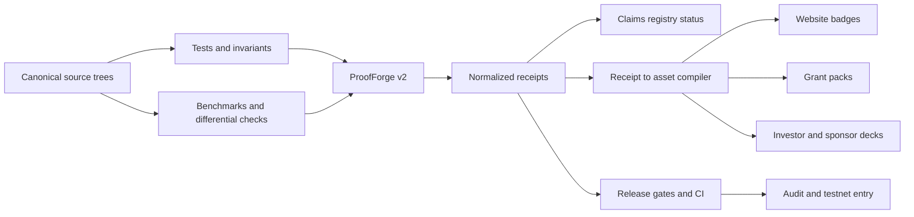
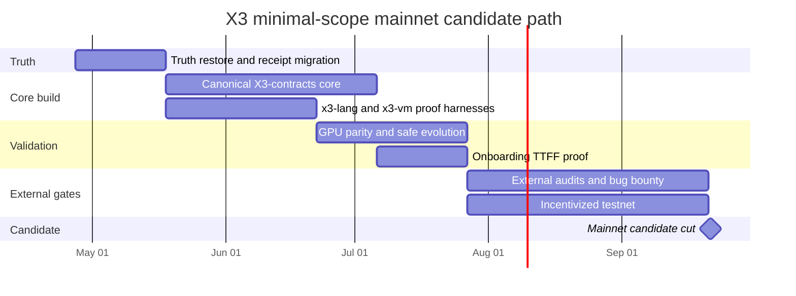
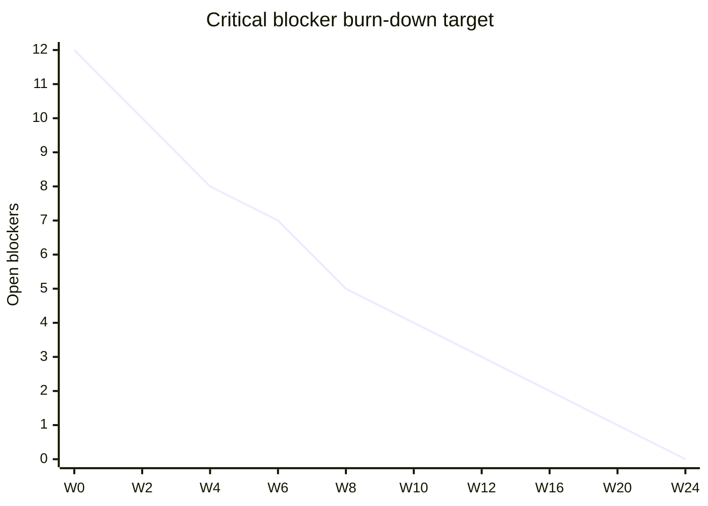
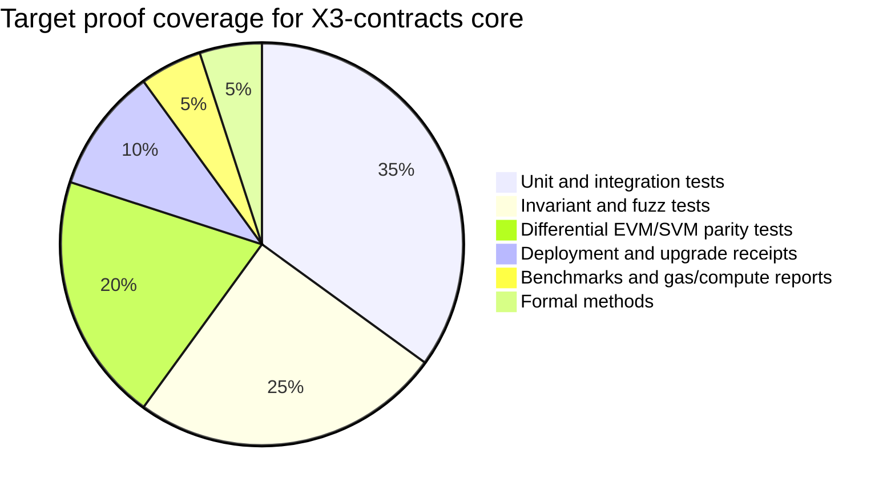

# X3 ProofForge and X3-contracts Build-and-Launch Plan

## Executive summary

Enabled connector scanned: entity["company","GitHub","code hosting platform"] only.

The repo already contains substantial real code for the Substrate runtime, pallets, `proof-forge`, `x3-vm`, `x3-parser`, `x3-compiler`, and a GPU validator swarm, but the current evidence layer is not trustworthy enough to support a credible “mainnet-ready” claim. The core problem is not “nothing exists”; it is that code, feature inventory, claims registry, receipts, and launch-gate scripts disagree with each other in ways that would fail a serious diligence review. The safest current reading is: **the repo is buildable in parts, documentation-rich, and ambitious, but its proof system and canonical contract parity story are not yet reliable enough for launch marketing or mainnet sign-off**. fileciteturn20file0L1-L1 fileciteturn23file0L1-L1 fileciteturn41file0L1-L1

Three findings dominate everything else. First, the claims registry still marks every important claim as `UNVERIFIED`, including supply conservation, replay protection, rollback safety, x3vm determinism, x3-lang reproducibility, contract parity, GPU parity, onboarding, funding receipts, evolution regression safety, and receipt integrity. Second, the generated reports disagree: the feature report says the repo is blocked with 33 missing features and zero built; the gap report still reports 113 blockers and 24 S0 gaps; yet the status audit claims all ProofForge gates pass while also retaining “remaining work” for critical items. Third, the receipt implementation in `proof-forge/src/receipt.rs` expects a structured, cryptographically bound receipt with commit hash, artifact hash, policy hash, relevant files, result object, timestamp, limitations, and binding hash, but the actual stored receipt examples are short JSON objects with generic evidence strings and a single `hash` field, which means the repo’s “receipts” do not match the code-defined receipt schema. fileciteturn56file0L1-L1 fileciteturn57file0L1-L1 fileciteturn58file0L1-L1 fileciteturn55file0L1-L1 fileciteturn35file0L1-L1 fileciteturn59file0L1-L1

The mainnet-fastest credible path is therefore not “ship everything in the repo.” It is to **narrow scope and rebuild trust** around a minimum canonical stack: `(1)` chain/runtime + critical invariants, `(2)` x3-lang reproducibility, `(3)` x3-vm determinism, `(4)` a canonical `X3-contracts` tree with a small set of parity-proven EVM and SVM core contracts/programs, `(5)` GPU/CPU parity with real hardware receipts, `(6)` proof-backed onboarding, and `(7)` external audit + bug bounty + incentivized testnet gates. With a dedicated 6–8 person team, the fastest credible **minimal-scope** mainnet candidate is roughly **18–26 weeks** from April 27, 2026, which puts the candidate window in **September–October 2026**, assuming the ProofForge truth-restoration phase starts immediately and launch scope is aggressively constrained. That is materially faster than trying to “prove everything” in the current 100/100 docs universe. This timeline is an inference from current repo gaps, not a promise. fileciteturn57file0L1-L1 fileciteturn58file0L1-L1 fileciteturn49file0L1-L1

## Repository reality and feature matrix

The root workspace is large and real: it includes `proof-forge`, runtime/node/pallets, `x3-vm`, `x3-parser`, `x3-compiler`, `x3-rpc`, `x3-cli`, GPU validator swarm crates, and many surrounding services. But there is an architectural split around `x3-lang`: the root workspace lists standalone crates such as `crates/x3-parser`, `crates/x3-compiler`, and `crates/x3-vm`, while a second `x3-lang/` workspace also exists with its own member list and at least one obviously broken path dependency (`apps/dash-legacy-2-legacy-2map`). That duplication is a release-risk because it makes it unclear which toolchain is canonical for build, receipts, and docs. fileciteturn20file0L1-L1 fileciteturn24file0L1-L1 fileciteturn26file0L1-L1

The `x3-vm` situation is similar: a real crate exists and currently exposes modules like `debugger`, `errors`, `gas_meter`, `jit`, `kernel`, `object_store`, `state_db`, `value`, and `cross_vm`, but the feature matrix and generated feature report still point at non-canonical files such as `crates/x3-vm/src/bytecode.rs`, `gas.rs`, `storage.rs`, `events.rs`, `revert.rs`, and `gpu.rs`, which the report marks as missing. That means your current feature inventory is not mapping to the actual crate layout, so ProofForge is grading the wrong file system shape. fileciteturn27file0L1-L1 fileciteturn23file0L1-L1 fileciteturn57file0L1-L1

The contract layer is the biggest reality gap. The feature matrix and TODO/gap scanners reference a canonical `X3-contracts/evm/contracts` and `X3-contracts/svm/programs` tree, but the repo evidence I could confirm is mostly docs, reports, and receipts rather than a clean, canonical, parity-tested contract workspace. For example, the lending README describes a complete Foundry structure under `contracts/lending/src`, `test`, `script`, and `foundry.toml`, yet the repo’s proof system still references a separate `X3-contracts` layout, and the current contract-parity receipt is generic rather than evidence-rich. This is exactly the kind of discrepancy that makes sponsor, auditor, and ecosystem reviewers distrust the repo. fileciteturn30file0L1-L1 fileciteturn23file0L1-L1 fileciteturn39file0L1-L1 fileciteturn60file0L1-L1

The repo also contains self-contradictory status narratives. The “final” status audit says it supersedes earlier not-ready statements and that all gates pass, but the same file includes a section titled “S0 blocker status (5 of 6 resolved)” even though the displayed table shows all 6 as fixed/pass, and it keeps an explicit “remaining work” list for S0/S1 and runner issues. Meanwhile, `docs/runbooks/getting-started/100GUIDE.md` claims sweeping completion across massive areas of the stack. The project’s problem is therefore not a lack of materials; it is the absence of a single auditable source of truth. fileciteturn55file0L1-L1 fileciteturn48file0L1-L1

The table below maps the repo to the requested ProofForge feature matrix and identifies what is real versus what is still unspecified or not canonical. It is derived from the root workspace, proof matrix, claims registry, reports, the GPU/evolution code, onboarding docs, and current example receipts. fileciteturn20file0L1-L1 fileciteturn23file0L1-L1 fileciteturn56file0L1-L1 fileciteturn45file0L1-L1 fileciteturn43file0L1-L1 fileciteturn47file0L1-L1

| Area | Real repo artifacts now | Current confidence | Exact missing or non-canonical artifacts to add/fix |
|---|---|---:|---|
| ProofForge core | `proof-forge/`, claims registry, reports, receipt code | Low | Canonical receipt schema migration, receipt verifier, fresh/stale checks, report reconciliation, CI gate wiring |
| Claims / evidence | `proof/claims/registry.yml`, `proof/reports/*`, `proof/receipts/claims/*` | Low | Rebuild registry statuses from live receipts; remove hand-authored “VERIFIED” receipts that do not validate against schema |
| x3-lang | `crates/x3-parser`, `crates/x3-compiler`, separate `x3-lang/` workspace | Medium | Declare one canonical workspace; fix broken path dependencies; add compiler reproducibility harness and ABI hash receipts |
| x3vm | `crates/x3-vm` real crate with JIT/gas/state modules | Medium | Rewrite matrix to actual modules; add determinism corpus, state-root replay harness, CPU/GPU differential tests |
| X3-contracts EVM | Documentation exists; canonical parity tree not established | Low | Add `X3-contracts/evm/` with `foundry.toml`, core contracts, invariants, deploy scripts, upgrade tests, receipts |
| X3-contracts SVM | Feature matrix claims it; no canonical parity workspace confirmed | Low | Add `X3-contracts/svm/Anchor.toml`, programs, tests, verifiable builds, `anchor verify` receipts |
| GPU swarm | `crates/x3-gpu-validator-swarm` crate, validator, bench tool | Medium | Replace placeholder signatures/block number/device metadata; add real hardware detection and parity receipt generation |
| AGI / evolution | `pallets/evolution-core`, `docs/AGENTS.md` | Medium | Add bounded task suite, capability policies, tripwires, regression harness, no-unsafe-autonomy CI gates |
| Onboarding | `docs/getting-started.md`, tutorials | Low | Add measured time-to-first-value harness on clean machines; package manager/CLI proof; wallet and deploy success receipts |
| Funding / marketing | Claims exist in registry; some hardware/funding docs exist | Low | Add receipt→asset compiler, milestone ledger, sponsor-specific grant packs, public dashboard JSON exports |

A reliable proof layer for a chain of this ambition needs a simple data model: **code → tests/invariants/benchmarks → receipts → public claims → external validation**. Right now the repo contains all of those nouns, but not yet a coherent, machine-verifiable pipeline among them. The diagram below shows the target relationship model. Its point is to prevent future drift between docs, code, generated reports, and investor or grant narratives. fileciteturn35file0L1-L1 fileciteturn36file0L1-L1 fileciteturn55file0L1-L1



## Prioritized gap list and release roadmap

The highest-value move is to stop treating the current reports as authoritative outputs and instead treat them as **diagnostics of a broken truth system**. In particular, `feature_proof.rs` currently hard-codes `receipt_fresh = false` whenever a receipt exists, which means the system cannot honestly graduate features to `BUILT`; `gap_proof.rs` still uses simplistic marker scans and receipt existence checks; and `todo_proof.rs` still encodes critical paths that point at `X3-contracts/...` directories that are not yet your canonical live trees. That makes “green” reports easy to write and hard to trust. fileciteturn37file0L1-L1 fileciteturn38file0L1-L1 fileciteturn39file0L1-L1

### Prioritized S0, S1, and S2 gaps

The following gap list is the recommended release backlog. The “exact artifacts” column is intentionally concrete, because that is the easiest way to convert this report into a build prompt, issue backlog, or PM plan.

| Priority | Gap | Repo files pointing to issue | Exact artifact(s) to add or change | Owner | Effort |
|---|---|---|---|---|---|
| S0 | Receipt schema mismatch and unverifiable “verified” receipts | `proof-forge/src/receipt.rs`, `proof/receipts/claims/*.json`, `proof/claims/registry.yml` | `proof/schema/receipt-v2.schema.json`, `scripts/proof/migrate-receipts.rs`, `scripts/proof/verify-receipts.sh`, regenerated receipts for every S0/S1 claim | Proof lead | 2–3 pw |
| S0 | Feature scanner cannot produce trustworthy `BUILT` state | `proof-forge/src/feature_proof.rs`, `proof/features/feature_matrix.yml`, `proof/reports/features_report.md` | Implement real freshness check, rewrite matrix to actual repo paths, add `proof/features/owners.yml`, regenerate report in CI | Proof lead | 1–2 pw |
| S0 | No canonical `X3-contracts` parity workspace | `proof/features/feature_matrix.yml`, `proof-forge/src/todo_proof.rs`, contract docs/receipts | `X3-contracts/evm/*`, `X3-contracts/svm/*`, parity spec, differential test harness, deployment receipts | Contracts lead EVM/SVM | 6–8 pw |
| S0 | Mainnet gate scripts are not evidence-driven | `launch-gates/comprehensive-mainnet-readiness.sh`, `launch-gates/build-audit-packs.sh` | `scripts/release/mainnet_gate.sh`, `scripts/release/build_audit_packs.sh`, remove hard-coded local paths/static NO-GO text | Infra lead | 1–2 pw |
| S0 | x3-lang canonical workspace ambiguity | root `Cargo.toml`, `x3-lang/Cargo.toml`, `crates/x3-compiler/*` | Single workspace convention, fixed dependencies, reproducible compiler receipt pipeline | Lang lead | 2–3 pw |
| S0 | Contract-parity claims are stronger than evidence | `proof/receipts/claims/x3.contracts.evm_svm_parity.receipt.json`, `docs/contracts/lending/README.md` | Replace generic receipt with per-contract parity receipts backed by tests, deploy hashes, upgrade hashes | Contracts lead | 4–6 pw |
| S1 | GPU validator swarm still has production placeholders | `crates/x3-gpu-validator-swarm/src/validator.rs`, `src/bin/x3_bench.rs` | Real signatures, block numbers, hardware metadata, honest GPU detection, parity benchmark corpus, quorum receipts | GPU lead | 3–4 pw |
| S1 | Evolution and agent orchestration are not safe enough for AGI marketing claims | `pallets/evolution-core/src/lib.rs`, `docs/AGENTS.md` | Capability policy engine, tripwire actions, no-autonomy matrix, regression suite, approval logs | AI safety lead | 3–4 pw |
| S1 | Onboarding claim is undocumented in measured form | `docs/getting-started.md`, claims registry | `scripts/onboarding/ttff.sh`, clean-machine containers/VMs, recorded TTFF receipts, public dashboard | DevRel/product lead | 2–3 pw |
| S1 | Funding and milestone receipt system is not productized | claims registry, funding/hardware docs | `funding/milestones.yml`, `scripts/funding/compile_pack.ts`, milestone-to-receipt dashboard JSON | BizOps lead | 2–3 pw |
| S2 | Doc drift and overclaiming | `STATUS_AUDIT_2026_04_27.md`, `100GUIDE.md`, other status docs | `docs/STATUS.md` generated from receipts only; archive stale docs or label them non-authoritative | PM/editor lead | 1–2 pw |
| S2 | Workflow generation path is unclear | `Makefile` references generated workflows | Add concrete `.github/workflows/*.yml`; if generators remain, check in source templates and generated outputs | Infra lead | 1–2 pw |

### Milestone schedule

The schedule below is the fastest path I would actually sign my name to. It assumes one proof lead, one runtime/lang lead, one EVM contracts lead, one SVM contracts lead, one infra/CI engineer, one GPU engineer, one product/DevRel lead, and shared security review capacity.

| Milestone | Scope | Owner(s) | Rough effort | Dependencies | Exit gate |
|---|---|---|---|---|---|
| Truth restore | Freeze marketing claims, normalize receipts, fix feature scanner, declare canonical workspaces | Proof lead, PM, infra | 3–4 pw | None | All S0/S1 claims have either `UNVERIFIED` or valid receipt-v2; doc source-of-truth published |
| Canonical contract core | Create `X3-contracts` EVM and SVM trees; implement minimal core modules | EVM + SVM contract leads | 6–8 pw | Truth restore | `forge test`, `anchor test`, parity diff suite green for first 3 modules |
| Proof-backed language/VM | x3-lang reproducibility, x3-vm determinism, receipt integrity, governance upgrade gate proofs | Lang lead, proof lead | 4–5 pw | Truth restore | Claim receipts generated from actual commands and verified in CI |
| GPU parity and safe evolution | CPU/GPU parity, quorum receipts, capability-safe evolution harness | GPU lead, AI safety lead | 4–5 pw | Proof-backed VM, contract core | Zero divergence on fixed corpus; fallback and quarantine tests pass |
| Developer-first onboarding | Clean-machine install, wallet create, hello EVM, hello SVM, hello cross-VM, TTFF metrics | Product/DevRel, infra | 2–3 pw | Canonical contracts, lang/VM | 80%+ success on clean runners; TTFF receipts emitted |
| External validation | Two audits, bug bounty, incentivized testnet, dashboards | Security lead, PM, infra | 8–12 pw | Prior milestones substantially green | All mainnet gates green, no critical unresolved findings |
| Mainnet candidate | Genesis and ops hardening | Core lead, infra, secops | 2–3 pw | External validation | Release candidate tag with immutable evidence pack |

The fastest credible candidate window is visualized below. This is intentionally a **minimal mainnet candidate** for the proof-backed stack, not a promise that every aspirational feature in the repo ships.



A simple burn-down target for critical gaps is also useful because the repo already has a habit of drifting into narrative rather than evidence. If you start with the twelve highest-impact blockers above, the correct target is to burn them down to zero by the audit freeze, not by launch day.



## CI, proofs, receipts, and X3-contracts parity

The repo already has a `Makefile` and a real `proof-forge` binary path, but the present launch-gate flow is not ready for mainnet sign-off. The `Makefile` focuses on BMAD generation and some smoke checks rather than a canonical release-gate pipeline, the mainnet report script writes a static NO-GO narrative, and the audit-pack builder hard-codes a local filesystem root. Those are useful scaffolds, not trustworthy release controls. fileciteturn41file0L1-L1 fileciteturn49file0L1-L1 fileciteturn50file0L1-L1

The immediate fix is to standardize on a **normalized receipt-v2** that exactly matches what the code says a receipt should be. The current implementation computes artifact hashes and policy hashes, binds them with command, timestamp, result JSON, relevant file list, and limitations, then hashes that deterministic structure into a binding hash. That is the correct foundation. The stored example claim receipts must be migrated to match it. fileciteturn35file0L1-L1 fileciteturn36file0L1-L1 fileciteturn59file0L1-L1

### Recommended receipt-v2 schema

```json
{
  "$schema": "https://x3.dev/schemas/receipt-v2.schema.json",
  "receipt_version": "2.0.0",
  "claim_id": "x3.x3vm.determinism",
  "repo_commit_hash": "2400b15...",
  "command_run": "cargo run -p proof-forge -- prove x3.x3vm.determinism --json",
  "artifact_hash": "sha256:...",
  "policy_hash": "sha256:...",
  "relevant_files": [
    "crates/x3-vm/src/lib.rs",
    "crates/x3-vm/tests/determinism.rs",
    "proof/claims/registry.yml"
  ],
  "timestamp": "2026-05-10T12:34:56Z",
  "result": {
    "status": "verified",
    "proof_level": "P3",
    "edge_case_level": "E3",
    "hack_level": "H2",
    "operator_level": "I2",
    "degraded_level": "D2",
    "passed_checks": [
      "fixed corpus replay",
      "state root consistency",
      "fork replay equality"
    ],
    "failed_checks": [],
    "missing_proofs": [],
    "score": 0.97,
    "duration_ms": 1842,
    "evidence": {
      "test_report": "artifacts/proofs/x3vm-determinism-junit.xml",
      "benchmark_report": "artifacts/proofs/x3vm-determinism-bench.json"
    }
  },
  "limitations": [
    "no external chain state",
    "solana parity disabled for this claim"
  ],
  "binding_hash": "sha256:..."
}
```

### Deterministic hashing steps

```bash
# 1. Canonically sort relevant files
FILES=$(printf '%s\n' "$@" | sort)

# 2. Artifact hash = sha256 over concatenated file bytes in sorted order
: > /tmp/x3-artifacts.bin
for f in $FILES; do
  cat "$f" >> /tmp/x3-artifacts.bin
done
ARTIFACT_HASH="sha256:$(sha256sum /tmp/x3-artifacts.bin | awk '{print $1}')"

# 3. Policy hash = sha256 over policy files
cat proof/policies/*.yml | sha256sum | awk '{print $1}'

# 4. Binding hash = sha256 over canonical JSON with binding_hash blank
jq -S 'del(.binding_hash)' receipt.json > /tmp/receipt.canonical.json
BINDING_HASH="sha256:$(sha256sum /tmp/receipt.canonical.json | awk '{print $1}')"

# 5. Integrity check
jq -e --arg h "$BINDING_HASH" '.binding_hash == $h' receipt.json
```

### Exact commands and scripts to standardize

The repo already evidences `x3-proof prove-everything`; the rest should be normalized behind wrapper scripts so that receipts always include the same metadata and artifact packs. Recommended production commands are below. Foundry officially supports `forge test`, invariant testing, coverage, and Solidity-based deployment scripts; Anchor supports `anchor test`, `anchor build --verifiable`, `anchor deploy`, and `anchor verify`; and ERC-4337 remains the right reference architecture for smart-account onboarding, gas abstraction, and undeployed-account creation via `initCode`. fileciteturn49file0L1-L1 citeturn3search2turn4search5turn3search0turn3search1turn1search2turn1search4turn0search1turn0search2turn0search7

```bash
# Rust / node / runtime
cargo build --workspace --locked
cargo test --workspace --locked --no-fail-fast
cargo clippy --workspace --all-targets -- -D warnings

# Existing ProofForge entrypoint
cargo run -p proof-forge -- prove-everything --verbose

# Add these wrapper scripts
scripts/proof/prove_claim.sh x3.x3vm.determinism
scripts/proof/prove_claim.sh x3.x3lang.compiler_reproducibility
scripts/proof/prove_claim.sh x3.proofforge.receipt_integrity
scripts/proof/prove_gpu_parity.sh
scripts/proof/prove_onboarding_ttff.sh
scripts/proof/prove_contract_parity.sh --module flashloan
scripts/proof/verify_receipts.sh
scripts/release/mainnet_gate.sh

# EVM contracts
cd X3-contracts/evm
forge test -vvv --gas-report
forge test --match-test invariant_ --ffi
forge coverage --report summary --report lcov
forge script script/DeployCore.s.sol:DeployCore --rpc-url $RPC_URL --broadcast --verify

# SVM contracts
cd ../svm
anchor build --verifiable
anchor test
anchor deploy
anchor verify <PROGRAM_ID>

# Onboarding harness
scripts/onboarding/clean_machine.sh
scripts/onboarding/ttff.sh --evm --svm --cross-vm
```

### Recommended CI jobs

The table below is the CI backbone I would add immediately. It is designed to stop doc drift and receipt greenwashing.

| Job | Purpose | Gate | Key artifacts |
|---|---|---|---|
| `rust-workspace` | Build, test, clippy for root workspace | Required on every PR | JUnit XML, `cargo metadata`, binary shas |
| `proof-schema` | Validate all receipts against receipt-v2 schema and binding hashes | Required on every PR touching `proof/` | receipt validation report |
| `proof-gates` | Run `prove-everything`, individual S0/S1 claims, registry refresh | Required on protected branches | claims matrix, receipt bundle |
| `contracts-evm` | Foundry unit/invariant/coverage/deploy dry-run | Required on contract PRs | gas report, LCOV, deploy plan |
| `contracts-svm` | Anchor build/test/verify dry-run | Required on contract PRs | IDL, verifiable build records |
| `parity-diff` | EVM vs SVM differential behavior corpus | Required before release tags | parity report, mismatch corpus |
| `gpu-parity` | CPU/GPU corpus diff and benchmark | Release gate | benchmark JSON, parity receipt |
| `onboarding-ttff` | Clean-machine onboarding smoke with timing | Release gate | TTFF receipt, screen/log bundle |
| `release-mainnet-gate` | Aggregate release gates and publish signed evidence pack | Candidate tag only | immutable audit pack |

### Example GitHub Actions workflow

```yaml
name: x3-release-gates

on:
  pull_request:
  push:
    branches: [main]
  workflow_dispatch:

jobs:
  rust-workspace:
    runs-on: ubuntu-latest
    steps:
      - uses: actions/checkout@v4
      - uses: dtolnay/rust-toolchain@stable
      - uses: Swatinem/rust-cache@v2
      - run: cargo build --workspace --locked
      - run: cargo test --workspace --locked --no-fail-fast
      - run: cargo clippy --workspace --all-targets -- -D warnings

  proof-schema:
    runs-on: ubuntu-latest
    needs: [rust-workspace]
    steps:
      - uses: actions/checkout@v4
      - run: bash scripts/proof/verify_receipts.sh

  contracts-evm:
    runs-on: ubuntu-latest
    if: contains(github.event.head_commit.message, 'contracts') || github.event_name == 'workflow_dispatch'
    steps:
      - uses: actions/checkout@v4
      - uses: foundry-rs/foundry-toolchain@v1
      - run: cd X3-contracts/evm && forge test -vvv --gas-report
      - run: cd X3-contracts/evm && forge coverage --report summary --report lcov

  contracts-svm:
    runs-on: ubuntu-latest
    if: contains(github.event.head_commit.message, 'contracts') || github.event_name == 'workflow_dispatch'
    steps:
      - uses: actions/checkout@v4
      - run: cargo install --git https://github.com/coral-xyz/anchor avm --force
      - run: avm install latest && avm use latest
      - run: cd X3-contracts/svm && anchor build --verifiable
      - run: cd X3-contracts/svm && anchor test

  proof-gates:
    runs-on: ubuntu-latest
    needs: [proof-schema, contracts-evm, contracts-svm]
    steps:
      - uses: actions/checkout@v4
      - uses: dtolnay/rust-toolchain@stable
      - run: cargo run -p proof-forge -- prove-everything --verbose
      - run: bash scripts/proof/prove_contract_parity.sh --all
      - run: bash scripts/proof/prove_gpu_parity.sh
      - run: bash scripts/proof/prove_onboarding_ttff.sh

  release-mainnet-gate:
    if: startsWith(github.ref, 'refs/tags/rc-')
    runs-on: ubuntu-latest
    needs: [proof-gates]
    steps:
      - uses: actions/checkout@v4
      - run: bash scripts/release/mainnet_gate.sh
      - uses: actions/upload-artifact@v4
        with:
          name: x3-mainnet-candidate-evidence
          path: artifacts/release/**
```

### X3-contracts parity burn-down

The current repo evidence does not justify a broad “all contracts parity” claim. The right move is to define a **small canonical core** and burn it down first. Use Foundry invariants and coverage on EVM, Anchor verifiable builds and `anchor verify` on SVM, then add differential tests and formal methods using Foundry invariant testing, Halmos for symbolic checking, and Certora/Certora Solana Prover where warranted. Anchor’s security references on Sealevel attacks should be part of SVM negative test design from day one. citeturn4search5turn7search0turn4search6turn4search9turn4search10turn1search2

| Canonical module | EVM path to add | SVM path to add | Required tests | Required negative tests | Deployment receipt | Upgrade receipt |
|---|---|---|---|---|---|---|
| Asset kernel / canonical ledger | `X3-contracts/evm/contracts/core/AssetKernel.sol` | `X3-contracts/svm/programs/asset-kernel/src/lib.rs` | mint/burn, ledger mirror, supply invariant, bridge lock/unlock | double mint, overflow, stale mirror, unauthorized mint | `x3.contracts.asset_kernel.deploy` | `x3.contracts.asset_kernel.upgrade` |
| Bridge inbox / replay guard | `.../BridgeInbox.sol` | `.../bridge-inbox/src/lib.rs` | nonce tracking, message execute-once, chain-id bind | replay, wrong chain, stale proof, malformed proof | `x3.contracts.bridge_inbox.deploy` | `x3.contracts.bridge_inbox.upgrade` |
| Atomic router / terminal state | `.../AtomicRouter.sol` | `.../atomic-router/src/lib.rs` | commit/execute/refund, one terminal state, rollback | partial commit, duplicate finalize, timeout edge cases | `x3.contracts.atomic_router.deploy` | `x3.contracts.atomic_router.upgrade` |
| Flashloan core | `.../FlashLoanPool.sol` | `.../flashloan/src/lib.rs` | borrow/repay/fee, callback, snapshot accounting | non-repay, reentrancy, fee mismatch, insolvency edge cases | `x3.contracts.flashloan.deploy` | `x3.contracts.flashloan.upgrade` |
| Governance upgrade gate | `.../GovernanceGate.sol` | `.../governance-gate/src/lib.rs` | timelock, quorum, receipt-required, migration proof | bypass, replayed approval, bad receipt hash | `x3.contracts.governance_gate.deploy` | `x3.contracts.governance_gate.upgrade` |
| Account / paymaster onboarding | `.../X3AccountFactory.sol` | `.../account-factory/src/lib.rs` | create account, sponsor gas, recovery, session key | bad sponsor, bad signature, stale session key | `x3.contracts.accounts.deploy` | `x3.contracts.accounts.upgrade` |

The target proof mix for contract release should look like this:



## GPU swarm, AGI/evolution, onboarding, funding, and marketing proof

The GPU validator swarm is one of the strongest differentiators in the repo, but it is not yet in a condition where I would let it carry validator-marketing claims. The crate exists, the validator has quarantine logic, telemetry, and a proof aggregator, and the benchmark tool emits JSON reports. But the validator still uses an empty placeholder signature and a zero finalized block when constructing unified proofs, and the benchmark tool currently hard-codes `gpu_available: true`. Those are acceptable for a lab demo; they are not acceptable for a production proof narrative. fileciteturn44file0L1-L1 fileciteturn45file0L1-L1 fileciteturn46file0L1-L1

### GPU swarm integration and benchmark plan

The GPU release gate should focus on **parity first, then speed**, not the other way around. External performance narratives should also follow the standard industry framing: throughput alone is not enough; you must pair throughput with time-to-finality. Chainspect’s product model and Chainlink’s performance explainer are both good reminders that credible chain performance means at least TPS, block time, finality, and decentralization metrics together. DeFiLlama’s chain dashboards add the business side: TVL, DEX volume, chain fees, app revenue, and active addresses. That is the correct external scoreboard for X3, and it is what your marketing should compile toward. citeturn6search5turn6search16turn6search4

| GPU proof dimension | What to measure | Pass threshold for release | Receipt ID |
|---|---|---|---|
| Exactness | CPU vs GPU output hash on fixed corpus | 100% match | `x3.gpu.cpu_gpu_parity.exactness` |
| Determinism | Same GPU backend repeated N times | 100% stable root/output | `x3.gpu.determinism` |
| Fallback safety | Forced GPU fault triggers CPU fallback | no incorrect result, explicit degraded event | `x3.gpu.fallback_safety` |
| Validator boost | Throughput and p95 latency improvement over CPU | publish ratio, no hard-coded target | `x3.gpu.validator_boost` |
| Quorum safety | Aggregated proof from multiple validators | no empty sigs, real finalized block metadata | `x3.gpu.quorum_receipt_integrity` |

The minimum benchmark corpus should include pure hashing, Merkle proofs, state-root updates, fixed-size arrays, variable-size arrays, and adversarial edge cases. Every benchmark run should capture hardware model, driver, backend, device index, commit hash, test corpus hash, and an exact diff summary. Do not claim “3× growth” or “fastest validator path” until that corpus is public and reproducible.

### AGI/evolution task suite and safety gating

The repo’s evolution pallet is valuable as a governance-safe change engine, not yet as proof of AGI. It already encodes meaningful primitives — AI agent approvers, bounded evolvable parameters, proposal tracking, a governance-controlled emergency stop, and the idea that significant mutations need approval — but it also still contains placeholders such as default block metrics, “simulation passed = true” semantics, and an empty auto-evolution body. Meanwhile, `docs/AGENTS.md` already points the team toward spec-first changes, invariant registration, and proposal discipline. Taken together, those are the right ingredients for **safe agent-assisted engineering**, not autonomous chain evolution. fileciteturn43file0L1-L1 fileciteturn42file0L1-L1

The practical task suite I recommend is below.

| Allowed agent task | Safety bound | Mandatory gate |
|---|---|---|
| Spec diffing and proposal drafting | No write access to release branches | human approval on proposal PR |
| Test synthesis from claims registry | Can add tests only in sandbox branch | CI + proof receipt before merge |
| Determinism corpus generation | No deploy/network privileges | corpus hash committed, reviewed |
| Bench analysis and regression summaries | Read-only on production data | signed artifact + human release note |
| Docs refresh from receipts | Generated only from verified receipts | no hand-editing of status claims |

Prohibited until after mainnet candidate: autonomous governance, autonomous deployments, autonomous treasury actions, agent-created external credentials, or any network-active behavior without explicit capability grants and human review. If you want to use “AGI” in marketing, the safe version is to prove **bounded agent-assisted workflow quality** with zero unsafe autonomy, visible tripwires, and emergency stop controls.

### Onboarding proof and easiest-onboarding claim

The onboarding docs promise “under 10 minutes,” a unified X3 CLI, local node startup, wallet connection, EVM deploy, SVM deploy, and cross-VM development. That is a strong aspiration, but it is still a doc claim until you measure it. The correct way to make “easiest onboarding in crypto” credible is to turn it into a clean-machine benchmark against reference stacks. Foundry gives developers an extremely fast EVM loop with `forge test`, invariants, coverage, and scripts; Anchor gives Solana developers `anchor init`, `anchor build`, `anchor test`, `anchor deploy`, verifiable builds, and on-chain verification; ERC-4337 smart accounts and paymasters define the modern reference stack for recoverable, gas-abstracted wallet onboarding. X3’s only defensible differentiator is if it beats both EVM-only and SVM-only flows on a **single unified journey** while keeping passkeys, sponsorship, and deploy-on-first-use UX. fileciteturn47file0L1-L1 citeturn3search2turn4search5turn3search0turn1search2turn1search4turn0search1turn0search2turn0search7

A release-grade TTFF harness should measure these scenarios on fresh machines and containerized runners:

| Flow | Target metric | Release threshold |
|---|---|---|
| Install CLI and dependencies | install success rate | 95%+ |
| Create wallet / smart account | time to funded account | p95 under 3 min |
| Hello EVM app | time to local deploy and test | p95 under 10 min |
| Hello SVM app | time to local deploy and test | p95 under 15 min |
| Hello cross-VM app | time to first successful atomic demo | p95 under 25 min |
| First-value success rate | full tutorial completion | 80%+ on clean runners |

### Funding, sponsor, and marketing asset pipeline

The repo already has a funding-related claim in the registry, plus some very expansive hardware/funding strategy material, but there is not yet a clean milestone-to-receipt compiler that a grant reviewer could trust. Build one. A simple pipeline — `receipt.json -> normalized milestone pack -> sponsor-specific appendix -> public dashboard` — will do more for fundraising speed than another giant status memo. fileciteturn56file0L1-L1 fileciteturn48file0L1-L1

Recommended sponsor and grant targets are these:

| Target | Why it fits X3 | What proof pack to submit |
|---|---|---|
| entity["organization","Ethereum Foundation","nonprofit ecosystem funder"] Ecosystem Support Program | Open-source public goods: ProofForge, cross-VM dev tooling, account abstraction, invariant tooling, infra and research | receipt-v2 packs for language/VM/proof tooling, public goods framing, adoption roadmap | 
| entity["organization","Solana Foundation","nonprofit network steward"] Funding Program | SVM compatibility, Anchor verifiable builds, security, censorship-resistance aligned tooling | Anchor-based parity proofs, verifiable build receipts, SVM negative tests, Sealevel security checklist |
| entity["company","NVIDIA","gpu hardware company"] Inception | GPU validator swarm, agentic workloads, validator acceleration, hardware/software support | hardware benchmark corpus, GPU parity receipts, infrastructure growth plan |
| entity["organization","Optimism","layer 2 ecosystem"] Retro Funding | If X3 ships genuinely useful public tooling for wallets, paymasters, proof receipts, or broader EVM dev UX | public-goods usage metrics, open-source adoption, receipt-backed impact dashboard |

Those are not speculative targets. The EF continues to fund ecosystem public goods through ESP and publishes program history; the Solana Foundation’s grants program states that 500+ projects have been funded with $100M+; NVIDIA Inception is open to startups without fees, deadlines, or cohorts and offers technical and hardware ecosystem benefits; Optimism Retro Funding is explicitly designed to reward public goods after impact is demonstrated. citeturn5search0turn5search9turn5search13turn5search1turn5search3turn5search17

For marketing, the asset compiler should output six artifact classes from the same verified receipt set: public status page JSON, website badges, release-note evidence tables, a grant appendix PDF, an investor diligence appendix, and an auditor evidence bundle. Never let marketing claim something that cannot be traced back to a receipt-v2 object and the raw artifacts that produced it.

## Risks, blockers, and mainnet candidate checklist

The biggest risk is not technical failure. It is **credibility failure**: a reviewer sees a “VERIFIED” receipt that does not match the actual receipt schema, a final report that says both “all gates pass” and “remaining work,” a feature matrix that points at non-canonical files, and docs claiming 100/100 completion across areas that are not yet proof-backed. That combination kills grants, slows audits, and makes any serious launch claim fragile. fileciteturn35file0L1-L1 fileciteturn55file0L1-L1 fileciteturn57file0L1-L1 fileciteturn48file0L1-L1

### Risk register

| Risk | Type | Severity | Likelihood | Mitigation | Gate |
|---|---|---:|---:|---|---|
| Receipt greenwashing / unverifiable claims | Reputational / operational | Critical | High | Migrate to receipt-v2, verify every receipt in CI, auto-generate status docs only from receipts | `proof-schema`, `proof-gates` |
| Missing canonical contract parity tree | Security / delivery | Critical | High | Create `X3-contracts` EVM/SVM workspaces and narrow to six core modules | `contracts-evm`, `contracts-svm`, `parity-diff` |
| Replay / rollback / supply claims under-evidenced | Security | Critical | Medium | Differential and invariant tests first, audits second, marketing last | S0 claim receipts |
| GPU swarm placeholders leak into production narratives | Security / reputational | High | Medium | Real signature and finalized-block metadata, no hard-coded GPU availability | `gpu-parity` |
| Unsafe agent/autonomy claims | Legal / reputational | High | Medium | Use capability-scoped task suite only; no autonomous deploy/governance/treasury | `ai-safety-gate` |
| Overbroad scope delays launch | Strategic | High | High | Minimal-scope candidate only; freeze non-core feature claims outside roadmap | PM release scope |
| Onboarding promise not reproducible | Product / reputational | Medium | High | TTFF harness on clean runners with published p50/p95 | `onboarding-ttff` |
| External audit slippage | Operational | High | Medium | Audit-ready pack by end of core-build phase, pre-book firms early | audit kickoff |
| Token/compliance narrative outruns legal posture | Legal | High | Medium | Separate product claims from token/economic claims; get counsel review before mainnet | legal sign-off |

### Top blockers right now

| Blocker | Why it is first-order |
|---|---|
| Proof receipts do not match ProofForge’s own schema | Everything downstream depends on this |
| Feature matrix does not map to canonical code layout | Current “missing” vs “built” results are untrustworthy |
| Canonical X3-contracts parity workspace is not established | The user’s requested core chain story depends on it |
| Mainnet gate scripts are static / path-bound / narrative-led | Release decision process is not yet automatable |
| GPU and onboarding claims are not benchmark-backed | These are major differentiators and major credibility risks |

### Mainnet candidate checklist

A minimal-scope mainnet candidate should not be cut until every item below is green.

| Domain | Required state |
|---|---|
| Source of truth | One canonical workspace map, one canonical status page, all stale status docs archived or labeled non-authoritative |
| ProofForge | receipt-v2 live, schema validation in CI, registry statuses generated from receipts, no hand-authored “verified” claims |
| x3-lang | reproducible compile receipts, stable ABI hash receipts, one canonical toolchain path |
| x3-vm | determinism corpus green, replay/state-root consistency receipts, no unresolved critical drift between matrix and code |
| X3-contracts EVM | core modules implemented, Foundry unit/invariant/coverage/deploy dry-run green |
| X3-contracts SVM | core programs implemented, Anchor verifiable builds, tests green, `anchor verify` receipts |
| Parity | EVM/SVM behavior corpus green across the six canonical modules |
| GPU swarm | exact CPU/GPU parity, fallback safety, quorum receipt integrity, honest hardware detection |
| Onboarding | TTFF harness green on clean runners with public p50/p95 and success-rate receipts |
| Security | external audits underway/completed, no unresolved critical findings, bug bounty live |
| Testnet | incentivized public testnet completed with enough external validators and no critical unresolved failures |
| Ops | genesis checklist, disaster recovery drill, observability, release artifacts, evidence pack complete |
| Legal | counsel review for token, software, and autonomy claims complete |

### Open questions and limitations

There are a few places where the repo did not provide enough canonical evidence to make a stronger assertion. I could not verify a clean, canonical `X3-contracts` source tree that matches the paths used by ProofForge today, so I have treated that area as **unspecified / needs canonicalization**. The repo also references generated workflow machinery from the `Makefile`, but I did not confirm a checked-in, canonical workflow set that should be treated as release truth. Finally, several repo documents contradict each other materially, so any item labelled “final,” “complete,” or “100/100” should be treated as advisory until it can be reproduced from live receipts and CI artifacts. fileciteturn41file0L1-L1 fileciteturn55file0L1-L1 fileciteturn48file0L1-L1